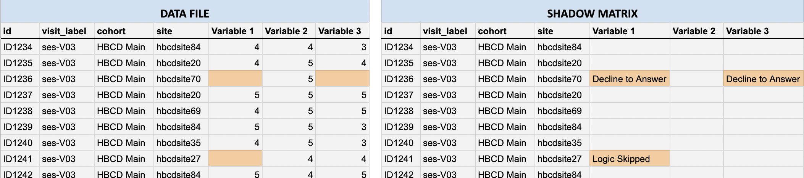

# Tabulated Data

  <i class="fa fa-hourglass-half"></i><i class="fa fa-person-cane"></i>
See <a href="../../instruments/agevariables/#tabulated-instrument-data" target="_blank">Age Variable Definitions</a> for documentation on fields reporting age in tabulated instrument data.

Tabulated data are participant-level summaries of study instrument (<a href="../../instruments/#behavior-biology-environment" target="_blank">behavior, biology, and environment</a>), <a href="../../instruments/#demo" target="_blank">Demographics</a>, and select <a href="../overview/#warning" target="_blank">file-based</a> data. Files are stored under `rawdata/phenotype/`:
<pre class="folder-tree">
hbcd/
|__ rawdata/ 
    |__ phenotype/ 
        |__ sed_basic_demographics.*        # Basic Demographics
        |__ par_visit_data.*                # Visit Information
        |__ bio_biosample_&lt;nails|urine&gt;.*   # Toxicology
        |__ {instrument_name}.*               # Instrument Data
</pre>

Key features of tabulated data include:

 - [Table Organization](#table-organization): tables are organized following the BIDS standard so that data from different sources can be linked together by participant ID and visit number
 - [File Types](#file-types): tables are available in both plain text (`.tsv`) and Parquet (`.parquet`) format, with accompanying metadata that explains the contents of each table

## Table Organization

Following the [BIDS](https://bids-specification.readthedocs.io/en/stable/modality-agnostic-files/phenotypic-and-assessment-data.html) standard, each table includes “identifier columns” for participant ID, visit number, and run number (when applicable) that allow you to link information between tables:

<table class="table-no-vertical-lines" style="width: 100%; border-collapse: collapse; table-layout: fixed;">
<thead>
  <th>Column Name</th>
  <th>Definition</th>
  <th style="width: 20%;">Example</th>
</thead>
<tbody>
<tr>
  <td><b><code>participant_id</code></b></td>
  <td style="word-wrap: break-word; white-space: normal;">Unique identifier for a participant</td>
  <td><code>sub-0123456789</code></td>
</tr>
<tr>
  <td><b><code>session_id</code></b></td>
  <td style="word-wrap: break-word; white-space: normal;">Unique identifier for session/visit number</td>
  <td><code>ses-V01</code></td>
</tr>
<tr>
  <td><b><code>run_id</code></b></td>
  <td style="word-wrap: break-word; white-space: normal;">Unique identifier for run number - <i>only present in tables derived from file-based data with multiple runs, e.g. for MRI acquisition</i></td>
  <td><code>1</code></td>
</tr>
</tbody>
</table>

## File Types

Tabulated data are available in two formats, **plain text files** (`.tsv`/`.csv`) and **Parquet** (`.parquet`) - [see details](#plain-text-vs-parquet-files) below. Each data table also comes with a **shadow matrix file** (`<instrument_name>_shadow.<tsv|parquet>`), which has the same structure of the corresponding data table, but contains codes explaining why values are missing - [see details](#shadow-matrices-for-missing-data) below. 

### Plain Text vs. Parquet Files

Tabulated data are provided in multiple formats to support a range of tools and user preferences. **Plain text files** (`.tsv`/`.csv`) are widely compatible and easy to open/inspect in Excel or text editors. Metadata (including column types, variable labels, categorical coding, etc.) is stored in separate `.json` files accompanying each plain text file. [Apache Parquet](https://parquet.apache.org/), or simply **Parquet** (`.parquet`), is a modern, compressed columnar format optimized for analysis and large-scale data. Unlike plain text files, metadata is embedded directly in parquet files, ensuring correct data types and enabling efficient loading and analysis in Python or R.

#### Which format should I use?

<table class="compact-table-no-vertical-lines" style="width: 100%; border-collapse: collapse; table-layout: fixed;">
  <thead>
    <tr>
      <th style="width: 10%;">Format</th>
      <th style="width: 25%;">When to use</th>
      <th style="width: 20%;">Advantages</th>
      <th style="width: 35%;">Limitations</th>
    </tr>
  </thead>
  <tbody>
    <tr>
      <td><b>TSV/CSV</b></td>
      <td style="word-wrap: break-word; white-space: normal;">Quick inspection, spreadsheet use</td>
      <td>
        <i style="color: blue;" class="fas fa-check"></i> Easy to open 
        <i style="color: blue;" class="fas fa-check"></i> Widely compatible format
      </td>
      <td>
        <i style="color: #ffa500;" class="fas fa-exclamation-triangle"></i> Large files load slowly 
        <i style="color: #ffa500;" class="fas fa-exclamation-triangle"></i> Separate metadata (<i>see <a href="#caution-using-plain-text-files-for-analysis">Caution</a> below</i>) 
        <i style="color: #ffa500;" class="fas fa-exclamation-triangle"></i> Selective column loading not supported
      </td>
    </tr>
    <tr>
      <td><b>Parquet</b></td>
      <td style="word-wrap: break-word; white-space: normal;">Analysis in Python/R for large data</td>
      <td>
        <i style="color: blue;" class="fas fa-check"></i> Optimized for large-scale data 
        <i style="color: blue;" class="fas fa-check"></i> Fast loading and smaller files 
        <i style="color: blue;" class="fas fa-check"></i> Metadata embedded 
        <i style="color: blue;" class="fas fa-check"></i> Ensures correctly specified data types 
        <i style="color: blue;" class="fas fa-check"></i> Supports selective column loading (saves memory)
      </td>
      <td>
        <i style="color: #ffa500;" class="fas fa-exclamation-triangle"></i> Not easily viewable in Excel 
        <i style="color: #ffa500;" class="fas fa-exclamation-triangle"></i> Not currently supported by <a href="https://bids-specification.readthedocs.io/en/stable/">BIDS</a>
      </td>
    </tr>
  </tbody>
</table>

#### Caution: Using Plain Text Files for Analysis

Plain text formats like TSV/CSV can cause problems in large-scale analyses due to the fact that **metadata is stored separately** (in sidecar JSON files). Python, R, or other tools may make mistakes when importing the data. For example:

- Tools may misinterpret data types, e.g., `0`/`1` used for “Yes/No” may be read as numeric instead of categorical.
- Columns with mostly missing values may be treated as empty if the first few rows contain no data.

**We therefore recommend using Parquet files for analysis to avoid these issues**, as the metadata is embedded directly. However, **if you do choose to use TSV/CSV files for analysis:** be sure to manually define column types during import using the sidecar JSON metadata files. We recommend using [NBDCtools](recprograms.md#tabulated-data) to automate this process - see documentation for the function `read_dsv_formatted()` [here](https://software.nbdc-datahub.org/NBDCtools/reference/read_dsv_formatted.html).

#### Working with Parquet in Python and R

  <i class="fa-brands fa-python"></i> / <i class="fa-brands fa-r-project"></i>
  
  Loading Parquet Files
  <a class="anchor-link" href="#load-parquet" title="Copy link">
  <i class="fa-solid fa-link"></i>
  </a>
  
  ▸

<strong>Loading parquet files in Python (<a href="https://docs.pola.rs/" target="_blank">polars</a> or <a href="https://pandas.pydata.org/docs/getting_started/index.html" target="_blank">pandas</a> module):</strong>

  <pre class="helper-code"><code>
    # Using `polars` module [RECOMMENDED]:
    import polars as pl
    parquet_df = pl.read_parquet("path/to/file.parquet")

    # Using `pandas` module:
    import pandas as pd
    parquet_df = pd.read_parquet("path/to/file.parquet")
  </code></pre>
<strong>Loading Parquet file in R (<a href="https://arrow.apache.org/docs/r/" target="_blank">arrow</a> package):</strong>
  <pre class="helper-code"><code>
    # Using `arrow` package:
    library(arrow)
    parquet_df <- read_parquet("path/to/file.parquet")
  </code></pre>

### Shadow Matrices for Missing Data

Each TSV or Parquet file in `/rawdata/phenotype/` has a corresponding **shadow matrix file** in the same format that record the reason for missing values (e.g., `Don't know`, `Decline to Answer`, `Logic Skipped`, etc.) in the phenotype data.

#### How They Work

In the data files, categorical codes for non-responses such as “Don’t know” (`999`) and “Decline to answer” (`777`) are deliberately converted to blank cells. The original responses are converted to a missingness reason stored in the shadow matrix, which mirror the structure and column names of the original data file (i.e. each cell corresponds to the same cell in the associated data file):

 - If a data cell contains a value: the shadow matrix cell is blank.
 - If a data cell is missing: the shadow matrix cell records the reason (e.g., “Don’t know”)
 
For example, compare the <mark style="background-color: #f9cb9b; font-weight: normal;">highlighted cells</mark> in the data file (*left*) vs. the corresponding shadow matrix (*right*) below:

#### Why Shadow Matrices Are Useful

Shadow matrices make analyses cleaner and more reliable by:

 - Preventing analytical errors, e.g., misinterpreting placeholder codes (like `777` or `999`) as valid numbers.
 - Maintaining consistent data types across entries (e.g., avoids mixing text notes into numeric fields).
 - Preserving non-response information without cluttering the main dataset.

#### Working with Shadow Matrices in Python and R 

While the approach of storing missingness reasons in a shadow matrix file supports cleaner analyses, **there are situations where non-responses are themselves meaningful.** For example, a researcher might be interested in how often participants do not understand a given question and how this relates to other variables. To understand patterns of missing data, users can re-integrate the non-responses from the shadow matrix back into the data using the following helper functions (*click to expand*):

  <i class="fa-brands fa-python"></i>
  
  Python
  <a class="anchor-link" href="#python-helper-function" title="Copy link">
  <i class="fa-solid fa-link"></i>
  </a>
  
  ▸

<pre class="helper-code"><code>
import pandas as pd
import os

def load_data_with_shadow(data_path, shadow_path):  
    """  
    Loads a data file (CSV or TSV) and its corresponding shadow matrix  
    (CSV or TSV) and adds '_missing_reason' columns for missing values.
    """  

    # Detect delimiter from file extension and load data
    def get_delimiter(path):
        ext = os.path.splitext(path)[1].lower()
        return "\t" if ext == ".tsv" else ","

    data = pd.read_csv(data_path, delimiter=get_delimiter(data_path))  
    shadow = pd.read_csv(shadow_path, delimiter=get_delimiter(shadow_path))

    # Annotate data with non-empty missingness reason columns (excluding participant_id 
    # and session_id) in shadow matrix 
    for col in data.columns[2:]:  
        if col in shadow.columns:
            if not shadow[col].isna().all() and not (shadow[col] == '').all():
                data[f"{col}_missing_reason"] = shadow[col]

    return data

# Example usage:
df = load_data_with_shadow("data.tsv", "shadow_matrix.tsv")

# Example: View reasons for missing data for a given column/variable in the data file 
df[df["&lt;COLUMN NAME&gt;"].isna()][["&lt;COLUMN NAME&gt;_missing_reason"]]
</code></pre>

  <i class="fa-brands fa-r-project"></i>
  
  R (using <a href="../recprograms/#tabulated-data">NBDCtools</a>)
  <a class="anchor-link" href="#r-helper-function" title="Copy link">
  <i class="fa-solid fa-link"></i>
  </a>
  
  ▸

  <pre class="helper-code"><code>
    library(dplyr)
    library(NBDCtools)

    # read in data and shadow matrix
    data <- arrow::read_parquet("path/to/data/&lt;table_name&gt;.parquet")
    shadow <- arrow::read_parquet("path/to/data/&lt;table_name_shadow&gt;.parquet")

    # bind shadow columns to data
    data_shadow <- shadow_bind_data(data, shadow)

    # show the reasons for missing values for a given variable
    data_shadow |>
      filter(is.na(&lt;column_name&gt;)) |> 
      count(&lt;column_name&gt;)
  </code></pre>

 