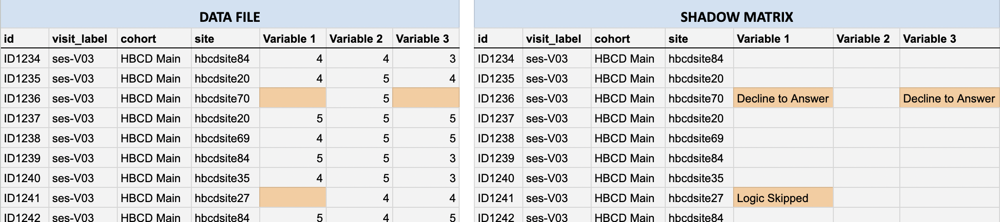

# Tabulated Data

  <i class="fa fa-hourglass-half"></i><i class="fa fa-person-cane"></i>
See <a href="../../instruments/agevariables/#tabulated-instrument-data" target="_blank">Age Variable Definitions</a> for documentation on fields reporting age in tabulated instrument data.

Tabulated data are participant-level summaries of HBCD Study instruments (<a href="../../instruments/#behavior-biology-environment" target="_blank">behavior, biology, and environment</a>), <a href="../../instruments/#demo" target="_blank">Demographics</a>, and select <a href="../overview/#warning" target="_blank">file-based</a> data. Files are stored under `rawdata/phenotype/`:
<pre class="folder-tree">
hbcd/
└── rawdata/ 
    └── phenotype/ 
        ├── sed_basic_demographics.*        # Basic Demographics
        ├── par_visit_data.*                # Visit Level Data
        ├── bio_biosample_{nails|urine}.*   # Toxicology
        └── {instrument_name}.*             # Instrument Data
</pre>

Key features of tabulated data include:

 - [Table Organization](#table-organization): tables are organized following the BIDS standard so that data from different sources can be linked together by participant ID and visit number
 - [File Types](#file-types): tables are available in both plain text (`.tsv`) and Parquet (`.parquet`) format, with accompanying metadata that explains the contents of each table

## Table Organization

Following the [BIDS](https://bids-specification.readthedocs.io/en/stable/modality-agnostic-files/phenotypic-and-assessment-data.html) standard, each table includes unique identifier columns for the following items that allow you to link information between tables:

 - Participant ID (<code>participant_id</code>)
 - Session/visit number (<code>session_id</code>)
 - Run number (<code>run_id</code>) - only as applicable, e.g., for MRI where multiple runs are acquired 
 
#### Study Design Logic: Child-Centric Data Structure

The HBCD Study organizes data around the Child ID as the primary key, meaning each caregiver and child share the same participant ID, with all caregiver-reported data nested under the corresponding Child ID. This structure supports longitudinal analyses by enabling straightforward tracking of each child’s data over time without needing to remap caregiver information. It also simplifies multi-birth cases: when a caregiver reports on multiple children, each child is assigned a unique record, so each child's data remains distinct (avoiding complex joins or disambiguation).

## File Types

Tabulated data are available in two formats, **plain text files** (`.tsv`/`.csv`) and **Parquet** (`.parquet`) - [see details](#plain-text-vs-parquet-files) below. Each data table also comes with a **shadow matrix file** (`<instrument_name>_shadow.<tsv|parquet>`), which has the same structure of the corresponding data table, but contains codes explaining why values are missing - [see details](#shadow-matrices-for-missing-data) below. 

### Plain Text vs. Parquet Files

Tabulated data are provided in multiple formats to support a range of tools and user preferences. **Plain text files** (`.tsv`/`.csv`) are widely compatible and easy to open/inspect in Excel or text editors and have metadata (including column types, variable labels, categorical coding, etc.) stored in accompanying `.json` files. [Apache Parquet](https://parquet.apache.org/), or simply **Parquet** (`.parquet`), is a modern, compressed columnar format optimized for analysis and large-scale data. Unlike plain text files, metadata is embedded directly in parquet files, ensuring correct data types and enabling efficient loading and analysis in Python or R.

  <i class="fa-solid fa-circle-info"></i>
  
    Which format should I use?
    <a class="anchor-link" href="#csv-vs-parquet" title="Copy link"><i class="fa-solid fa-link"></i></a>
  ▸

<table class="compact-table-no-vertical-lines">
  <thead>
    <tr>
      <th>Format</th>
      <th>Advantages</th>
      <th>Limitations</th>
    </tr>
  </thead>
  <tbody>
    <tr>
      <td><b>TSV/CSV</b> 
        <i>Quick inspection/spreadsheets</i>
      </td>
      <td>
        <i style="color: blue;" class="fas fa-check"></i> Easy to open 
        <i style="color: blue;" class="fas fa-check"></i> Widely compatible format
      </td>
      <td>
        <i style="color: #ffa500;" class="fas fa-exclamation-triangle"></i> Large files load slowly 
        <i style="color: #ffa500;" class="fas fa-exclamation-triangle"></i> Separate metadata (<i>see <a href="#caution-using-plain-text-files-for-analysis">Caution</a> below</i>) 
        <i style="color: #ffa500;" class="fas fa-exclamation-triangle"></i> Selective column loading not supported
      </td>
    </tr>
    <tr>
      <td><b>Parquet</b> 
        <i>Large data analysis in Python/R</i>
      </td>
      <td>
        <i style="color: blue;" class="fas fa-check"></i> Optimized for large-scale data 
        <i style="color: blue;" class="fas fa-check"></i> Fast loading and smaller files 
        <i style="color: blue;" class="fas fa-check"></i> Metadata embedded 
        <i style="color: blue;" class="fas fa-check"></i> Ensures correctly specified data types 
        <i style="color: blue;" class="fas fa-check"></i> Supports selective column loading (saves memory)
      </td>
      <td>
        <i style="color: #ffa500;" class="fas fa-exclamation-triangle"></i> Not easily viewable in Excel 
        <i style="color: #ffa500;" class="fas fa-exclamation-triangle"></i> Not currently supported by <a href="https://bids-specification.readthedocs.io/en/stable/">BIDS</a>
      </td>
    </tr>
  </tbody>
</table>

#### <i style="color: #ffa500;" class="fas fa-exclamation-triangle header-icon"></i> CAUTION: Using Plain Text Files for Analysis

For large data, plain text formats (TSV/CSV) can cause import issues (in Python, R, etc.) due to the separation of metadata. **We therefore recommend using Parquet files for analysis whenever possible to avoid these issues.** Parquet files embed metadata directly, ensuring correct data types and handling of missing values. Common issues include:

- Misinterpretation of data types, e.g., `0`/`1` used for “Yes/No” may be read as numeric instead of categorical
- Mishandling missing values (columns with mostly missing values may be treated as empty)

**If you do use CSV/TSV files for analysis:** be sure to (1) manually define column types during import using the sidecar JSON metadata files and (2) replace blank values with `n/a` (missing values are blank in HBCD data following [BIDS specification](https://bids-specification.readthedocs.io/en/stable/common-principles.html#tabular-files)). We recommend using [NBDCtools](../access/tools.md#tabulated-data) to automate these processes (e.g. [`read_dsv_formatted()`](https://software.nbdc-datahub.org/NBDCtools/reference/read_dsv_formatted.html)).

#### Working with Parquet in Python and R

  <i class="fa-brands fa-python"></i>&nbsp;<i class="fa-brands fa-r-project"></i>
  
  Loading Parquet Files
  <a class="anchor-link" href="#load-parquet" title="Copy link">
  <i class="fa-solid fa-link"></i>
  </a>
  
  ▸

<pre>Loading parquet files in Python (<a href="https://docs.pola.rs/" target="_blank">polars</a> or <a href="https://pandas.pydata.org/docs/getting_started/index.html" target="_blank">pandas</a> module):<code>
  # Using `polars` module [RECOMMENDED]:
  import polars as pl
  parquet_df = pl.read_parquet("path/to/file.parquet")

  # Using `pandas` module:
  import pandas as pd
  parquet_df = pd.read_parquet("path/to/file.parquet")
</code></pre>
<pre>Loading Parquet file in R (<a href="https://arrow.apache.org/docs/r/" target="_blank">arrow</a> package):<code>
  # Using `arrow` package:
  library(arrow)
  parquet_df <- read_parquet("path/to/file.parquet")
</code></pre>

### Shadow Matrices for Missing Data

Each TSV or Parquet file in `/rawdata/phenotype/` has a corresponding **shadow matrix file** in the same format that record the reason for missing values (e.g., `Don't know`, `Decline to Answer`, `Logic Skipped`, etc.) in the phenotype data.

  <i class="fa-solid fa-circle-info"></i>
  
  Shadow Matrix Values for Missingness
  <a class="anchor-link" href="#sm-values" title="Copy link">
  <i class="fa-solid fa-link"></i>
  </a>
  
  ▸

<b>Possible Values Across Instruments</b> 
The following are standard possible values for missingness reason found in the shadow matrices across instruments.

<ul>
<li><strong>Decline to Answer</strong> (e.g., participant declined to answer a question)</li>
<li><strong>Don't Know</strong> (e.g., participant did not know the answer)</li>
<li><strong>Missed Visit</strong> (e.g., participant did not attend a visit)</li>
<li><strong>Missed Instrument</strong> (e.g., participant did not complete assessment)</li>
<li><strong>Logic Skipped</strong> (e.g., question skipped due to branching logic)</li>
<li><strong>Unknown Missing</strong> (e.g., reason for missing value unknown)</li>
</ul>

 Note that <b>for cases where an instrument was not administered</b>, this would be indicated in the shadow matrix as 'Unknown Missing' for blank entries (as well as 'Logic Skipped' for fields skipped due to branching logic). There is also an 'Administration' field for all instruments that indicates whether an instrument was administered or not for a given participant/visit.

<b>Special Cases</b> 
The following domains/instruments have additional unique shadow matrix values used where applicable:

<table class="table-no-vertical-lines">
<thead>
<tr>
<th>Table(s)</th>
<th>Unique Shadow Matrix Values [<i>+Variable Name If Specific</i>]</th>
</tr>
</thead>
<tbody>
<tr>
<td><strong>BioSpecimens (<i>All</i>)</strong></td>
<td>
  <ul>
    <li><i>"Please refer to corresponding categorical field for more details"</i></li>
  </ul>
</td>
</tr>
<tr>
<td><strong>Basic Demographics</strong></td>
<td>
  <ul>
    <li><i>"Child's DOB not reported or available for participant"</i> [<code>{gestational|mother}_age_delivery</code>]</li>
    <li><i>"Missing Information From Ripple"</i> [<a href="../../instruments/demo/basicdemo/#acs-derived-variables" target="_blank">ACS-derived fields</a>]</li>
  </ul> 
</td>
</tr>
<tr>
<td><strong>Visit Level Data</strong></td>
<td>
  <ul>
    <li><i>"Data not available for participants at this timepoint"</i></li>
    <li><i>"No candidate age for V01"</i> [<code>candidate_age</code>]</li>
    <li><i>"Gestational Age at Administration is only at V01 and not calculated for V02 onwards"</i> [<code>gestational_age</code>]</li>
  </ul>
</td>
</tr>
</tbody>
</table>

#### How They Work

In the data files, categorical codes for non-responses such as “Don’t know” (`999`) and “Decline to answer” (`777`) are deliberately converted to blank cells. The original responses are converted to a missingness reason stored in the shadow matrix, which mirror the structure and column names of the original data file (i.e. each cell corresponds to the same cell in the associated data file):

 - If a data cell contains a value: the shadow matrix cell is blank.
 - If a data cell is missing: the shadow matrix cell records the reason (e.g., “Don’t know”)
 
For example, compare the <mark style="background-color: #f9cb9b; font-weight: normal;">highlighted cells</mark> in the data file (*left*) vs. the corresponding shadow matrix (*right*) below:

#### Why Shadow Matrices Are Useful

Shadow matrices make analyses cleaner and more reliable by:

 - Preventing analytical errors, e.g., misinterpreting placeholder codes (like `777` or `999`) as valid numbers.
 - Maintaining consistent data types across entries (e.g., avoids mixing text notes into numeric fields).
 - Preserving non-response information without cluttering the main dataset.

#### Working with Shadow Matrices in Python and R 

While the approach of storing missingness reasons in a shadow matrix file supports cleaner analyses, **there are situations where non-responses are themselves meaningful.** For example, a researcher might be interested in how often participants do not understand a given question and how this relates to other variables. To understand patterns of missing data, users can re-integrate the non-responses from the shadow matrix back into the data using the following helper functions (*click to expand*):

  <i class="fa-brands fa-python"></i>
  
  Python
  <a class="anchor-link" href="#python-helper-function" title="Copy link">
  <i class="fa-solid fa-link"></i>
  </a>
  
  ▸

<pre><code>import pandas as pd
import os

def load_data_with_shadow(data_path, shadow_path):  
    """  
    Loads a data file (CSV or TSV) and its corresponding shadow matrix  
    (CSV or TSV) and adds '_missing_reason' columns for missing values.
    """  

    # Detect delimiter from file extension and load data
    def get_delimiter(path):
        ext = os.path.splitext(path)[1].lower()
        return "\t" if ext == ".tsv" else ","

    data = pd.read_csv(data_path, delimiter=get_delimiter(data_path))  
    shadow = pd.read_csv(shadow_path, delimiter=get_delimiter(shadow_path))

    # Annotate data with non-empty missingness reason columns (excluding participant_id 
    # and session_id) in shadow matrix 
    for col in data.columns[2:]:  
        if col in shadow.columns:
            if not shadow[col].isna().all() and not (shadow[col] == '').all():
                data[f"{col}_missing_reason"] = shadow[col]

    return data

# Example usage:
df = load_data_with_shadow("data.tsv", "shadow_matrix.tsv")

# Example: View reasons for missing data for a given column/variable in the data file 
df[df["&lt;COLUMN NAME&gt;"].isna()][["&lt;COLUMN NAME&gt;_missing_reason"]]
</code></pre>

  <i class="fa-brands fa-r-project"></i>
  
  R (using <a href="../../access/tools.md#tabulated-data">NBDCtools</a>)
  <a class="anchor-link" href="#r-helper-function" title="Copy link">
  <i class="fa-solid fa-link"></i>
  </a>
  
  ▸

<pre><code>library(dplyr)
library(NBDCtools)

# read in data and shadow matrix
data <- arrow::read_parquet("path/to/data/&lt;table_name&gt;.parquet")
shadow <- arrow::read_parquet("path/to/data/&lt;table_name_shadow&gt;.parquet")

# bind shadow columns to data
data_shadow <- shadow_bind_data(data, shadow)

# show the reasons for missing values for a given variable
data_shadow |>
  filter(is.na(&lt;column_name&gt;)) |> 
  count(&lt;column_name&gt;)
</code></pre>

