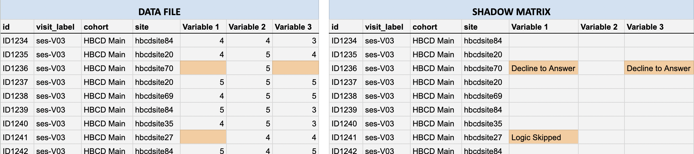

# Tabulated Data

Tabulated data contain participant-level summaries for the majority of HBCD behavioral/phenotypical instruments (as well as [tabulated pipeline derivatives](overview.md#tabulated-pipeline-derivatives)). Tables follow the BIDS organizational structure so data from different sources can be linked by participant ID and visit number. Files are stored in `rawdata/phenotype/`:

<pre class="folder-tree">
hbcd/
└── rawdata/ 
    └── phenotype/ 
        ├── sed_basic_demographics.*        # Basic Demographics
        ├── par_visit_data.*                # Visit Level Data
        ├── bio_biosample_{nails|urine}.*   # Toxicology
        └── [instrument_name].*             # Instrument Data
</pre>

## File Formats

Each table is available as:

* **TSV/CSV**: plain text files for easy inspection and broad compatibility
* **Parquet**: compressed files optimized for efficient analysis in Python and R ([see details](https://parquet.apache.org/))
* **Shadow matrix**: a companion file that records why individual values are missing

### TSV/CSV vs. Parquet

One of the key difference between these file types is that TSV/CSV file types store metadata in accompanying `.json` files, whereas Parquet stores metadata directly in the file, reducing import errors and improving performance for large datasets. Review the table below to choose the optimal format for your needs:

<table class="table-no-vertical-lines">
  <thead>
    <tr>
      <th>Format</th>
      <th>Best for</th>
      <th>Advantages</th>
      <th>Limitations</th>
    </tr>
  </thead>
  <tbody>
    <tr>
      <td><strong>TSV/CSV</strong></td>
      <td>Quick inspection and spreadsheets</td>
      <td>
        <ul>
          <li>Easy to open</li>
          <li>Widely compatible</li>
        </ul>
      </td>
      <td>
        <ul>
          <li>Slower for large files</li>
          <li>Metadata stored separately</li>
          <li>No selective column loading</li>
        </ul>
      </td>
    </tr>
    <tr>
      <td><strong>Parquet</strong></td>
      <td>Analysis in Python or R</td>
      <td>
        <ul>
          <li>Fast and compact</li>
          <li>Embedded metadata</li>
          <li>Preserves data types</li>
          <li>Supports selective column loading</li>
        </ul>
      </td>
      <td>
        <ul>
          <li>Not easily viewed in Excel</li>
          <li>Not currently supported by BIDS</li>
        </ul>
      </td>
    </tr>
  </tbody>
</table>

  <i class="fas fa-exclamation-triangle" style="color: #ffa500;"></i>
    &nbsp;<b>WARNING: Incorrect Data Types Inferred for CSV/TSV</b>
 
 

Because TSV/CSV metadata are stored separately, programming languages like Python or R must guess the data types during import, which can lead to errors. For example, categorical values provided as numbers that are formatted as strings (e.g., "0"/"1" to represent “Yes”/“No”) may be interpreted as numeric. To avoid this, users need to manually specify column types using the accompanying metadata upon import. The <a href="../access/tools/#nbdctools">NBDCtools</a> R package offers a helper function, <a href="https://software.nbdc-datahub.org/NBDCtools/reference/read_dsv_formatted.html"><code>read_dsv_formatted()</code></a>, to automate this process (see the R packages page for details).

  <i class="fa-brands fa-python"></i>&nbsp;<i class="fa-brands fa-r-project"></i>
  
  Loading Parquet Files in Python/R
  <a class="anchor-link" href="#load-parquet" title="Copy link">
  <i class="fa-solid fa-link"></i>
  </a>
  
  ▸

<pre>Loading parquet files in Python (<a href="https://docs.pola.rs/">polars</a> or <a href="https://pandas.pydata.org/docs/getting_started/index.html">pandas</a> module):<code>
  # Using `polars` module [RECOMMENDED]:
  import polars as pl
  parquet_df = pl.read_parquet("path/to/file.parquet")

  # Using `pandas` module:
  import pandas as pd
  parquet_df = pd.read_parquet("path/to/file.parquet")
</code></pre>
<pre>Loading Parquet file in R (<a href="https://arrow.apache.org/docs/r/">arrow</a> package):<code>
  # Using `arrow` package:
  library(arrow)
  parquet_df <- read_parquet("path/to/file.parquet")
</code></pre>

---

### Shadow Matrices for Missing Data

Every TSV or Parquet file in `rawdata/phenotype/` has a corresponding **shadow matrix** in the same format. The shadow matrix has the same structure and column names as its data file but records **why values are missing**. For example, non-response codes such as `999` (“Don't Know”) and `777` (“Decline to Answer”) are converted to blank cells in the main data file. Their meaning is preserved in the corresponding shadow matrix. For each cell:

* **Data value present →** shadow matrix cell is blank.
* **Data value missing →** shadow matrix cell contains the reason for missingness.

  <i class="fa-solid fa-circle-info"></i>
  
  Missingness Reasons
  <a class="anchor-link" href="#sm-values" title="Copy link">
  <i class="fa-solid fa-link"></i>
  </a>
  
  ▸

Common shadow matrix values include:

<ul>
<li><strong>Decline to Answer</strong>- participant declined to answer a question</li>
<li><strong>Don't Know</strong>- participant did not know the answer</li>
<li><strong>Missed Visit</strong>- participant did not attend a visit</li>
<li><strong>Missed Instrument</strong>- participant did not complete assessment</li>
<li><strong>Logic Skipped</strong>- question skipped due to branching logic</li>
<li><strong>Unknown Missing</strong>- reason for missing value unknown and/or instrument was not administered (check against the <i>Administration</i> field included for instruments)</li>
</ul>

The following domains/instruments have additional unique shadow matrix values used where applicable:

<table class="table-no-vertical-lines">
<thead>
<tr>
<th>Table(s)</th>
<th>Unique Shadow Matrix Values [<i>+Variable Name If Specific</i>]</th>
</tr>
</thead>
<tbody>
<tr>
<td><strong>BioSpecimens (<i>All</i>)</strong></td>
<td>
  <ul>
    <li><i>"Please refer to corresponding categorical field for more details"</i></li>
  </ul>
</td>
</tr>
<tr>
<td><strong>Basic Demographics</strong></td>
<td>
  <ul>
    <li><i>"Child's DOB not reported or available for participant"</i> [<code>{gestational|mother}_age_delivery</code>]</li>
    <li><i>"Missing Information From Ripple"</i> [<a href="../../instruments/demo/basicdemo/#acs-derived-variables">ACS-derived fields</a>]</li>
  </ul> 
</td>
</tr>
<tr>
<td><strong>Visit Level Data</strong></td>
<td>
  <ul>
    <li><i>"Data not available for participants at this timepoint"</i></li>
    <li><i>"No candidate age for V01"</i> [<code>candidate_age</code>]</li>
    <li><i>"Gestational Age at Administration is only at V01 and not calculated for V02 onwards"</i> [<code>gestational_age</code>]</li>
  </ul>
</td>
</tr>
</tbody>
</table>

#### Why Use Shadow Matrices?

Separating missingness reasons from the primary data:

* Prevents placeholder codes such as `777` or `999` from being interpreted as valid numeric values
* Keeps column data types consistent
* Preserves information about non-response without cluttering the main dataset

In some analyses, the reason a value is missing may itself be meaningful. For example, researchers may want to examine how often participants report that they do not understand a question. In these cases, missingness information can be joined back to the primary data via the methods below.

  <i class="fa-brands fa-python"></i>
  
  Python
  <a class="anchor-link" href="#python-helper-function" title="Copy link">
  <i class="fa-solid fa-link"></i>
  </a>
  
  ▸

<pre><code># Example 1: Load CSV/TSV and corresponding shadow matrix and add '_missing_reason' columns for missing values.
import pandas as pd
import os

def load_data_with_shadow(data_path, shadow_path):  
    # Detect delimiter from file extension and load data
    def get_delimiter(path):
        ext = os.path.splitext(path)[1].lower()
        return "\t" if ext == ".tsv" else ","
    data = pd.read_csv(data_path, delimiter=get_delimiter(data_path))  
    shadow = pd.read_csv(shadow_path, delimiter=get_delimiter(shadow_path))

    # Annotate data with non-empty missingness reason columns (excluding participant_id, session_id) in shadow matrix 
    for col in data.columns[2:]:  
        if col in shadow.columns:
            if not shadow[col].isna().all() and not (shadow[col] == '').all():
                data[f"{col}_missing_reason"] = shadow[col]
    return data

# Example usage:
df = load_data_with_shadow("data.tsv", "shadow_matrix.tsv")
# Example: View reasons for missing data for a given column/variable in the data file 
df[df["&lt;COLUMN NAME&gt;"].isna()][["&lt;COLUMN NAME&gt;_missing_reason"]]
</code></pre>

<pre><code>
# Example 2: Using NBDCtools Python package
# install R backend with `NBDCtools` is required to run this code
from NBDCtools import create_dataset
create_dataset(
    dir_data="path/to/data",
    study="hbcd",
    vars=["var1", "var2", "var3"],
    tables=["table1", "table2"],
    bind_shadow=True
)</code>
</pre>

  <i class="fa-brands fa-r-project"></i>
  
  R (using NBDCtools)
  <a class="anchor-link" href="#r-helper-function" title="Copy link">
  <i class="fa-solid fa-link"></i>
  </a>
  
  ▸

<pre><code>library(NBDCtools)
create_dataset(
  dir_data = "path/to/data",
  study = "hbcd",
  vars = c("var1", "var2", "var3"),
  tables = c("table1", "table2"),
  bind_shadow = TRUE
)
</code></pre>

<!-- 
Replaced code above per request of ABCD team:
library(dplyr)
library(NBDCtools)

# read in data and shadow matrix
data <- arrow::read_parquet("path/to/data/&lt;table_name&gt;.parquet")
shadow <- arrow::read_parquet("path/to/data/&lt;table_name_shadow&gt;.parquet")

# bind shadow columns to data
data_shadow <- shadow_bind_data(data, shadow)

# show the reasons for missing values for a given variable
data_shadow |>
  filter(is.na(&lt;column_name&gt;)) |> 
  count(&lt;column_name&gt;) -->