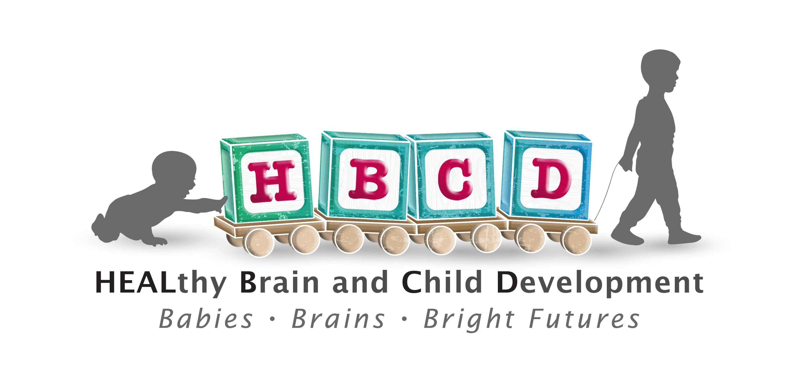
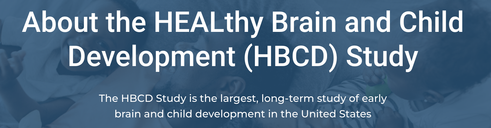
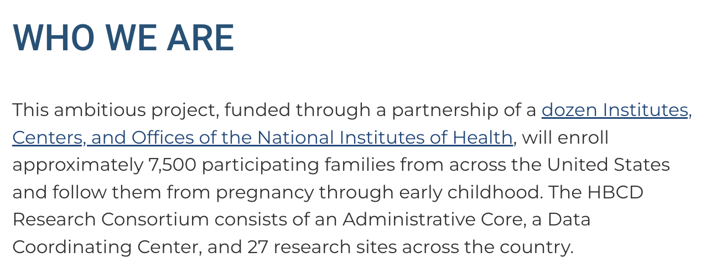
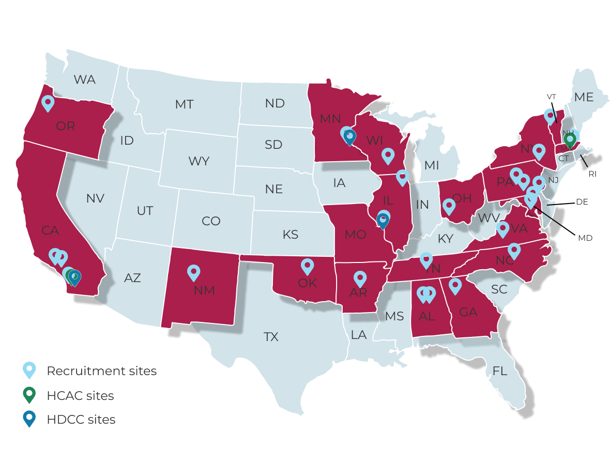

Welcome to the Data Release Docs for the HEALthy Brain and Child Development (HBCD) Study!

Explore detailed information about HBCD Study Data Releases, including access guidelines, responsible data use policies, measure descriptions, and standardized procedures for data formatting, quality control, and processing.

 
 
Annual data releases, hosted by the <a href="https://nbdc-splash-beta.lassoinformatics.com/hbcd-study">NIH Brain Development Cohorts (NBDC) Data Hub</a>, include information from the current participant cohort and all visits completed up to just before the release date. The inaugural HBCD Data Release 1.0, available 2025-06-26, includes prenatal data from over 1300 pregnant participants as well as follow-up data from over half of their babies.

 
 

Please refer to the central HBCD Study page (<a href="https://hbcdstudy.org/">hbcdstudy.org</a>) for comprehensive information about the study and complete <a href="https://hbcdstudy.org/study-protocols/">Study Protocols</a>.
 

  <a class="button-link" href="https://nbdc-splash-beta.lassoinformatics.com/hbcd-study">HBCD Study on NBDC Data Hub &nbsp; ↗️</a>

--------------

<i>The information below is sourced directly from the central HBCD Study page. For additional details, please visit <a href="https://hbcdstudy.org/about/">https://hbcdstudy.org/about/</a></i>

