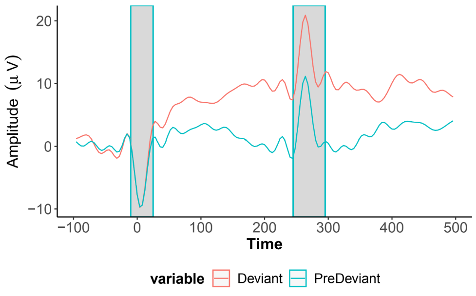

# Electroencephalography 

HBCD includes four electroencephalography (EEG) tasks acquired during visits V03, V04, and V06 - click to be directed to task documentation pages:

<ul>
<li><a href="mmn" target="_blank">Auditory Mismatch Negativity (MMN)</a></li>
<li><a href="faces" target="_blank">Faces (FACE)</a></li>
<li><a href="dmri" target="_blank">Video Resting State (RS)</a></li>
<li><a href="vep" target="_blank">Visual Evoked Potential (VEP)</a></li>
</ul>

## Release Data

    <i class="fas fa-exclamation-circle"></i>
    
    Responsible Use Warning
    <a class="anchor-link" href="#alert" title="Copy link">
    <i class="fa-solid fa-link"></i>
    </a>
    
  ▸

The HBCD EEG data and EEG preprocessing outputs do not contain any personally identifiable information. It is important to consider that potentially stigmatizing conclusions could emerge from the inappropriate use of the EEG data together with available demographic information or questionnaires. Furthermore, all EEG tasks are all passive at the V03 age range and therefore conclusions should not be drawn about behavioral performance.
 

Methodologically, there are a number of best practices for responsible data use that will be included with each file. The first is selecting files that maintain a minimum trial threshold recommendation. For each task, there are three levels of quality control thresholds that can be used: (1) our QC thresholds used to provide feedback to sites on each upload, (2) a 30% trial retention threshold (which we use internally to indicate usability of an EEG recording), and (3) the reliability recommendations for each task.

<li><b>Threshold recommendations by task:</b></li>
<li>RS - 108 trials</li>
<li>FACE - 15 trials for each condition of interest</li>
<li>MMN - 30 trials for each condition of interest</li>
<li>VEP - 36 trials.</li>

An additional consideration for responsible use of the HBCD EEG dataset applies to disproportionate missing data. It is possible that some participant data may be systematically missing from this dataset by virtue of not meeting the QC thresholds. For instance, with infants that are inattentive and prone to fussing out during the EEG recording, more data may be removed from their datasets by our preprocessing scripts. A similar risk holds with participants  who have thick or dense hairstyling and hair texture, which may impact capping success, impedance, and data quality (<a href="https://doi.org/10.1038/s41539-024-00240-y">Adams et al., 2024</a>). The consortium has proactively worked to address this risk by using scheduling procedures that are flexible to participants hairstyling routines and by purchasing 3 long pedestal nets per site in sizes appropriate for the V03, V04, and V06 visits (<a href="https://doi.org/10.1038/s41539-024-00240-y">Adams et al., 2024</a>; <a href="https://doi.org/10.1016/j.dcn.2024.101396">Mlandu et al., 2024</a>). Preliminary analyses indicate that capping quality for visits where the long pedestal net was used have been consistent with capping quality seen for the dataset at large.

It is important to use these data in a manner which takes into account that physical and neurological differences between groups are not necessarily representative of intrinsic qualities of a given demographic  group. Discussions around data patterns should be sensitive to societal factors. In addition, it is important to note that variation within demographic populations is greater than variation across populations. Demographic markers are categorical proxies that cannot capture or explain the causal mechanisms that may account for evident differences.

  <i class="fas fa-exclamation-triangle"></i>
  
  Data Warnings
  <a class="anchor-link" href="#warning" title="Copy link">
  <i class="fa-solid fa-link"></i>
  </a>
  
  ▸

<b>HBCD EEG Utilities</b> 
The EEG Core of the HBCD Data Coordinating Center (HDCC) has developed some helpful tools for extracting summary statistics and trial measures from HBCD EEG release data. We encourage all users to explore these resources at the <a href="https://hbcd-eeg-utilities.readthedocs.io/">HBCD EEG Utilities</a> website.

<b>Stimtracker Artifact</b> 
The MMN, VEP, and FACE task data for one participant included in the data release was found to contain an electrical noise artifact originating from the stimtracker device used for stimulus timing. All other participants' data were checked and confirmed to be artifact-free.
 

This artifact is most prominent in electrode E55 between the REF and COM electrodes, but is also visible in surrounding channels. It is time-locked to both stimulus onset and offset: as highlighted in the following EEG trace (MMN auditory oddball task in E55), the artifact presents as a negative deflection at onset and a positive deflection at offset.

<i class="fa-regular fa-lightbulb"></i> <i><a href="artifacts" target="_blank">Click here</a> for information on how this artifact appears in time-frequency plots and ERP derivatives.</i>

 

The EEG workgroup is currently developing a method of ICA correction to remove this artifact. In the meantime, <strong>it is recommended to exclude the MMN, VEP, and FACE tasks for this participant from analyses</strong>. The ID of the impacted participant along with this documentation is available to DUC users in the <a href="http://docs-private.hbcdstudy.org/">HBCD Private Release Notes</a> accessible via the <a href="https://nbdc-datashare.lassoinformatics.com/help-center">Lasso Help Center</a>.

<b>Task Updates Between V03 and V04/V06</b> 
The video content for the Resting State task and interstimulus interval (ISI) for the Auditory Mismatch Negativity task both changed between visits V03 and V04/V06 - see <a href="https://doi.org/10.1016/j.dcn.2024.101447">Fox et al. 2024</a> and <a href="https://doi.org/10.1097/00003446-200204000-00005">Morr et al. 2002</a> for details. Also note that RS is not a true resting state as there is a visual stimulus present.

  <i class="fas fa-bug"></i>
  This data has known issues - <a href="../../changelog/knownissues/#eeg" target="_blank">see details</a>.

EEG data in the release includes file-basedimaging and biosignal data (varied formats) and tabulatedinstrument and derived data (tabulated format) data:

- <i class="fa fa-hammer"></i> <a href="../../../datacuration/rawbids" target="_blank">Raw BIDS</a> under subject- and session-specific <code>eeg/</code> folders (*file-based data*)
- <i class="fas fa-cog"></i> <a href="../../../datacuration/derivatives" target="_blank">Derivatives</a> processed through the HBCD-MADE pipeline under <code>made/</code> (*file-based data*)
- <i class="fas fa-table"></i> <a href="../../../datacuration/phenotypes" target="_blank">Tabulated</a> data tables derived from the HBCD-MADE pipeline derivatives - see full list of tables <a href="../../#eeg" target="_blank">here</a>

### Raw BIDS

  
  
  BIDS Conversion Procedures: EEG
  <a class="anchor-link" href="#bids-eeg" title="Copy link">
  <i class="fa-solid fa-link"></i>
  </a>
  
  ▸

EEG BIDS conversion was handled by <a href="https://github.com/aces/eeg2bids">EEG2BIDS Wizard</a>, a custom MATLAB application developed for HBCD EEG data management and BIDS formatting installed at all HBCD sites. After each EEG session, raw data are uploaded to the Wizard, which, among other things, converts this data to the BIDS standard data structure.

The `eeg/` folder contains raw EEG data in BIDS format including information about the recording system, location of electrodes, and events for each task:

<pre class="folder-tree">
hbcd/
|__ rawdata/ 
    |__ sub-&lt;label&gt;/   
        |__ ses-&lt;label&gt;/
            |__ eeg/
                | # TASK ACQUISITIONS:
                |__sub-&lt;label&gt;_ses-&lt;label&gt;_task-&lt;FACE|MMN|RS|VEP&gt;_acq-&lt;eeg|ecg&gt;_channels.tsv
                |__sub-&lt;label&gt;_ses-&lt;label&gt;_task-&lt;FACE|MMN|RS|VEP&gt;_acq-&lt;eeg|ecg&gt;_eeg.json
                |__sub-&lt;label&gt;_ses-&lt;label&gt;_task-&lt;FACE|MMN|RS|VEP&gt;_acq-&lt;eeg|ecg&gt;_eeg.set
                |__sub-&lt;label&gt;_ses-&lt;label&gt;_task-&lt;FACE|MMN|RS|VEP&gt;_acq-&lt;eeg|ecg&gt;_events.tsv
                |__sub-&lt;label&gt;_ses-&lt;label&gt;_task-&lt;FACE|MMN|RS|VEP&gt;_acq-&lt;eeg|ecg&gt;_events.json
                |__sub-&lt;label&gt;_ses-&lt;label&gt;_task-&lt;FACE|MMN|RS|VEP&gt;_acq-eeg_eeg.fdt
                |
                | # LOCATION OF ELECTRODES:
                |__sub-&lt;label&gt;_ses-&lt;label&gt;_acq-eeg_space-&lt;CapTrak|CTF&gt;_electrodes.tsv
                |__sub-&lt;label&gt;_ses-&lt;label&gt;_acq-eeg_space-&lt;CapTrak|CTF&gt;_coordsystem.json
                |
                |__ sourcedata/
                    |__ sub-&lt;label&gt;_ses-&lt;label&gt;_acq-eeg_impedances.json
                    |__ sub-&lt;label&gt;_ses-&lt;label&gt;_task-&lt;FACE|MMN|RS|VEP&gt;_acq-eeg_eventlogs.txt
</pre>

<table class="table-no-vertical-lines" style="width: 100%; border-collapse: collapse; table-layout: fixed;">
<thead>
    <th></th>
    <th>File</th>
    <th>Description</th>
</thead>
<tbody>
<tr>
    <td rowspan="2">Task Acquisition Files</td>
    <td><code>SET</code></td>
    <td style="word-wrap: break-word; white-space: normal;">Metadata and parameters for the EEG dataset, such as channel locations, sampling rate, and event information.</td>
</tr>
<tr>
    <td><code>FDT</code></td>
    <td style="word-wrap: break-word; white-space: normal;">Field data table files containing EEG data</td>
</tr>

<tr>
    <td rowspan="2">Location of Electrodes</td>
    <td><code>*_electrodes.tsv</code></td>
    <td style="word-wrap: break-word; white-space: normal;">Specifies the location of electrodes, placed on either the head (<code>acq-eeg</code>) or chest (<code>acq-ecg</code>)</td>
</tr>
<tr>
    <td><code>*_coordsystem.json</code></td>
    <td style="word-wrap: break-word; white-space: normal;">Cartesian coordinates followed by <code>*_electrodes.tsv</code> files</td>
</tr>
<tr>
    <td rowspan="2">Sourcedata</td>
    <td><code>*_impedence.json</code></td>
    <td style="word-wrap: break-word; white-space: normal;">Impedance values used to ensure good electrode contact</td>
</tr>
<tr>
    <td><code>*_eventlogs.txt</code></td>
    <td style="word-wrap: break-word; white-space: normal;">Task stimuli presentations</td>
</tr>
</tbody>
</table>

### Derivatives

HBCD-MADE produces preprocessed EEG derivatives. See the [HBCD-MADE documentation](https://docs-hbcd-made.readthedocs.io/en/latest) for a full explanation of the derivative files displayed below.

<pre class="folder-tree">
hbcd/
|__ derivatives/ 
    |__ made/
        |__ sub-&lt;label&gt;/
            |__ ses-&lt;label&gt;/
                |__ eeg/
                    |__ filtered_data/
                    |   |__ SUBSES_task-&lt;FACE|MMN|RS|VEP&gt;_acq-eeg_desc-filtered_eeg.fdt
                    |   |__ SUBSES_task-&lt;FACE|MMN|RS|VEP&gt;_acq-eeg_desc-filtered_eeg.set
                    |
                    |__ ica_data/
                    |   |__ SUBSES_adjustReport.txt
                    |   |__ SUBSES_desc-mergedICA_eeg.fdt
                    |   |__ SUBSES_desc-mergedICA_eeg.set
                    | 
                    |__ merged_data/
                    |   |__ SUBSES_desc-merged_eeg.fdt
                    |   |__ SUBSES_desc-merged_eeg.json
                    |   |__ SUBSES_desc-merged_eeg.set
                    | 
                    |__ processed_data/
                    |   |__ sub-&lt;label&gt;_task-FACE_desc-&lt;FACE-JPG&gt;.jpg
                    |   |__ sub-&lt;label&gt;_task-MMN_desc-&lt;MMN-JPG&gt;.jpg
                    |   |__ SUBSES_task-RS_powerSummaryStats.csv
                    |   |__ sub-&lt;label&gt;_task-VEP_&lt;desc-oz_ERP|topo&gt;.jpg
                    |   |__ SUBSES_task-&lt;FACE|MMN|VEP&gt;_acq-eeg_ERP.mat
                    |   |__ SUBSES_task-&lt;FACE|MMN|RS|VEP&gt;_acq-eeg_desc-filteredprocessed_eeg.fdt
                    |   |__ SUBSES_task-&lt;FACE|MMN|RS|VEP&gt;_acq-eeg_desc-filteredprocessed_eeg.set
                    | 
                    |__ SUBSES_acq-eeg_preprocessingReport.csv
                    |__ SUBSES_task-&lt;FACE|MMN|RS|VEP&gt;_acq-eeg_MADEspecification.json
</pre>

Label Values Legend

  <b style="color: #0077cc;">FACE-JPG</b>: Oz_diffERP, diffInvVsUpr_topo, diffObjVsUp2_topo, inverted_topo, object_topo, oz_ERP, upright_topo, upright2_topo

  <b style="color: #0077cc;">MMN-JPG</b>: deviant_topo, diffDevVsSta_topo, diffDevVsPre_topo, preDeviant_topo, standard_topo, t7t8_diffERP, t7t8_ERP

*See [Format of File Structure Visuals](#visformat) for guidance on interpreting the folder tree above.*

## EEG Protocols

For full details on the HBCD EEG protocol, please refer to [Fox et al. 2024](https://doi.org/10.1016/j.dcn.2024.101447) published in the Developmental Cognitive Neuroscience special issue on HBCD.

*Source: [HBCD Study Protocols - EEG](https://hbcdstudy.org/wp-content/uploads/2023/06/EEG-Parameters.pdf)*

## Quality Control    
After EEG acquisition, quality control checks are performed using [EEG2BIDS Wizard](https://github.com/aces/eeg2bids), a custom MATLAB application installed at all HBCD sites. These checks are immediately provided to the user to ensure the data's integrity and usability. The process includes:

- Verifying event markers in the EEG data to confirm all required events are accurately recorded.
- Ensuring the setup for stimulus presentation and EEG data acquisition adheres to the study protocol.
- Inspecting electrode impedances to ensure they are within acceptable limits.
- Detecting multiple task runs and incomplete recordings.
- Confirming the use of correct E-Prime task versions.

Both study sites and the EEG Core team use an EEG Quality Control dashboard developed by LORIS to access and monitor incoming EEG data and QC metrics, such as retained epochs and line noise levels. Outputs from the HBCD-Maryland Analysis of Developmental EEG ([HBCD-MADE](https://hbcd-made.readthedocs.io/en/latest/)) pipeline, which handles preprocessing and data cleaning, are also integrated into the dashboard. These outputs include key metrics like outlier statistics for specific task epochs ([Debnath et al., 2020](https://doi.org/10.1111/psyp.13580)). Regular site-specific check-ins and troubleshooting are conducted to ensure consistent protocol adherence and data quality across sites. For a detailed description of QC procedures in the HBCD Study EEG protocol, refer to [Fox et al., 2024](https://doi.org/10.1016/j.dcn.2024.101447).

During quality control, a frequently observed issue across all tasks was the irregular application of EEG sensors. Additionally, partial task completion due to infant fussing and missing stimulus flags were commonly noted for the faces and auditory mismatch negativity tasks.

### EEG Net Placement ("Capping Quality") Ratings

  <i class="fa-regular fa-lightbulb"></i>
    EEG data with a capping quality rating of "Not usable" are not included in the current release. Capping ratings can be found in the tabulatedinstrument and derived data (tabulated format) QC file for each task (<code>eeg_qc_task-&lt;TASK&gt;</code>).

EEG capping quality ratings are used to determine inclusion in the data release pool and subsequent processing. Photos are taken for each acquisition from the front, back, top, left, and right angles of the participant's head and uploaded via the BIDS Wizard application to a secure computing environment. They are then reviewed by the EEG Core at the University of Maryland to rate the quality of EEG net placement, or "capping quality," for each acquisition. 

“Average”, "Poor," and "Not usable" ratings correspond to net placement shifted 1-2 cm, 2-3 cm, and >3 cm from proper placement, respectively. To be rated as "Excellent," acquisitions must meet the following criteria:

1.	Net placement is symmetrical with midline electrodes centered on the scalp
2.	Ears are within the ear holes and not covered by sensors 
3.	Reference electrode is placed on the vertex of the scalp
4.	Electrode E17 is placed on the nasion

Please refer to the [HBCD EEG Acquisition Protocol](https://zenodo.org/records/14795030) for additional information about capping requirements.

## Resources
- [HBCD EEG Utilities](https://hbcd-eeg-utilities.readthedocs.io/)
- [HBCD E-Prime Task Manual](https://docs.google.com/document/d/1PghQQpLbxjQavtVlHyIz7JVJxlyKcC4Do8z8j7srdaI/edit?usp=sharing)
- [HBCD EEG Acquisition Protocol](https://zenodo.org/records/14795030)

## References

    
Debnath, R., Buzzell, G. A., Morales, S., Bowers, M. E., Leach, S. C., & Fox, N. A. (2020). The Maryland analysis of developmental EEG (MADE) pipeline. Psychophysiology, 57(6), e13580. <a href="https://doi.org/10.1111/psyp.13580" target="_blank">https://doi.org/10.1111/psyp.13580</a>
  
    
Fox, N. A., Pérez-Edgar, K., Morales, S., Brito, N. H., Campbell, A. M., Cavanagh, J. F., Gabard-Durnam, L. J., Hudac, C. M., Key, A. P., Larson-Prior, L. J., Pedapati, E. V., Norton, E. S., Reetzke, R., Roberts, T. P., Rutter, T. M., Scott, L. S., Shuffrey, L. C., Antúnez, M., Boylan, M. R., … Yoder, L. (2024). The development and structure of the Healthy Brain and Child Development (HBCD) study EEG Protocol. <i>Developmental Cognitive Neuroscience</i>, 69, 101447. <a href="https://doi.org/10.1016/j.dcn.2024.101447" target="_blank">https://doi.org/10.1016/j.dcn.2024.101447</a>
 

 

## Extra

<table class="table-no-vertical-lines" style="width: 100%; border-collapse: collapse; table-layout: fixed;">
<tbody>
<tr>
    <td>Task Acquisition Files</td>
    <td style="word-wrap: break-word; white-space: normal;">The <code>SET</code> files contain metadata and parameters for the EEG dataset, such as channel locations, sampling rate, and event information. The <code>FDT</code> files are field data table files containing EEG data</td>
</tr>
<tr>
    <td>Location of Electrodes</td>
    <td style="word-wrap: break-word; white-space: normal;">The location of electrodes, placed on either the head (<code>acq-eeg</code>) or chest (<code>acq-ecg</code>), is specified in the <code>*_electrodes.tsv</code> files following cartesian coordinates provided in the <code>*_coordsystem.json</code> file. For **task acquisitions**, the task is specified by <code>task-<label></code>, with task options of `FACE`, `MMN`, `RS`, and `VEP`</td>
</tr>
<tr>
    <td>Sourcedata</td>
    <td style="word-wrap: break-word; white-space: normal;">
    <ul>
    The accompanying <code>sourcedata/</code> files include:
    <li>Impedance values used to ensure good electrode contact (<code>*_impedence.json</code>)</li>
    <li>Task stimuli presentations (<code>*_eventlogs.txt</code>)</li>
    </ul>
    </td>
</tr>
</tbody>
</table>