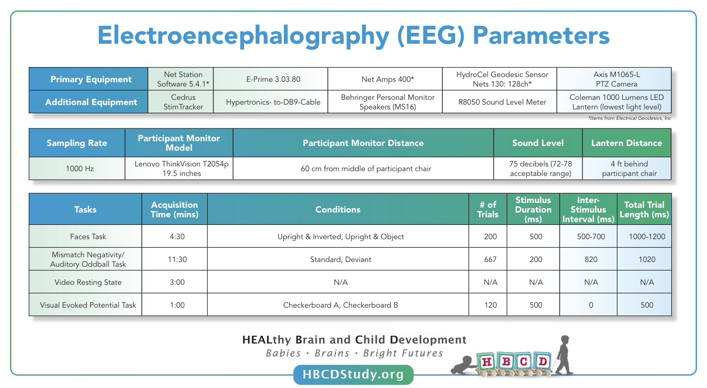

# Overview & EEG Protocols

The HBCD study includes four electroencephalography (EEG) tasks collected during visits V03, V04, and V06: **Auditory Mismatch Negativity** (MMN), **Faces** (FACE), **Video Resting State** (RS), and **Visual Evoked Potential** (VEP). See [HBCD EEG Tasks](tasks.md) for detailed descriptions of each task.

## EEG Protocols

**EEG protocols** are described in detail in [Fox et al. 2024](https://doi.org/10.1016/j.dcn.2024.101447) and fully documented in [HBCD EEG Acquisition Protocol](https://zenodo.org/records/14795030).

## Release Data

    <i class="fas fa-exclamation-circle"></i>
    
    Responsible Use Warning
    <a class="anchor-link" href="#alert" title="Copy link">
    <i class="fa-solid fa-link"></i>
    </a>
    
  ▸

The HBCD EEG data and EEG preprocessing outputs do not contain any personally identifiable information. It is important to consider that potentially stigmatizing conclusions could emerge from the inappropriate use of the EEG data together with available demographic information or questionnaires. Furthermore, all EEG tasks are all passive at the V03 age range and therefore conclusions should not be drawn about behavioral performance.
 

Methodologically, there are a number of best practices for responsible data use that will be included with each file. The first is selecting files that maintain a minimum trial threshold recommendation. For each task, there are three levels of quality control thresholds that can be used: (1) our QC thresholds used to provide feedback to sites on each upload, (2) a 30% trial retention threshold (which we use internally to indicate usability of an EEG recording), and (3) the reliability recommendations for each task.

<b>Threshold recommendations by task:</b>
<ul>
<li>RS - 108 trials</li>
<li>FACE - 15 trials for each condition of interest</li>
<li>MMN - 30 trials for each condition of interest</li>
<li>VEP - 36 trials.</li>
</ul>

An additional consideration for responsible use of the HBCD EEG dataset applies to disproportionate missing data. It is possible that some participant data may be systematically missing from this dataset by virtue of not meeting the QC thresholds. For instance, with infants that are inattentive and prone to fussing out during the EEG recording, more data may be removed from their datasets by our preprocessing scripts. A similar risk holds with participants  who have thick or dense hairstyling and hair texture, which may impact capping success, impedance, and data quality (<a href="https://doi.org/10.1038/s41539-024-00240-y">Adams et al., 2024</a>). The consortium has proactively worked to address this risk by using scheduling procedures that are flexible to participants hairstyling routines and by purchasing 3 long pedestal nets per site in sizes appropriate for the V03, V04, and V06 visits (<a href="https://doi.org/10.1038/s41539-024-00240-y">Adams et al., 2024</a>; <a href="https://doi.org/10.1016/j.dcn.2024.101396">Mlandu et al., 2024</a>). Preliminary analyses indicate that capping quality for visits where the long pedestal net was used have been consistent with capping quality seen for the dataset at large.

It is important to use these data in a manner which takes into account that physical and neurological differences between groups are not necessarily representative of intrinsic qualities of a given demographic  group. Discussions around data patterns should be sensitive to societal factors. In addition, it is important to note that variation within demographic populations is greater than variation across populations. Demographic markers are categorical proxies that cannot capture or explain the causal mechanisms that may account for evident differences.

EEG release data include both **file-based** (raw and processed data files in modality-specific formats) and **tabulated** (instrument and derived data in a standardized table format) data.      
<i>See the <a href="../../datacuration/overview" target="_blank">Data Structure Overview</a> for a full explanation of these data types.</i>

 - <i class="fa fa-hammer"></i> <a href="../../datacuration/file-based-data/#raw-bids" target="_blank">Raw BIDS</a> stored under subject- and session-specific <code>eeg/</code> folders      
 - <i class="fas fa-cog"></i> <a href="../../datacuration/file-based-data/#processed-derivatives" target="_blank">Processed derivatives</a> generated by the HBCD-MADE pipeline      
 - <i class="fas fa-table"></i> <a href="../../datacuration/phenotypes" target="_blank">Tabulated data</a> derived from HBCD-MADE pipeline outputs — see the full list of EEG-specific tables <a href="../#eeg" target="_blank">here</a>

  <i class="fa-solid fa-circle-info"></i>
  Note: Differences in Session Counts Between Raw and Derivative Data

All EEG data collected for HBCD are available on the <a href="../../access/download/#explore-download-hbcd-study-data">NBDC Data Access Platform</a> as raw BIDS files, but derivatives are not released for all sessions. Derivatives for any given session may be unavailable due to any of the following reasons:

<ul>
<li>EEG acquisitions did not undergo MADE processing due to “very poor” capping quality or missing EEG cap placement images.</li>
<li>Technical issues or user error during data collection resulted in MADE processing errors (approximately 2% of EEG visits). Some of these files containing technical issues may be available in future data releases.</li>
</ul>

  <i class="fa fa-folder-tree"></i>
  
Raw BIDS Files (<code>eeg/</code>)
  <a class="anchor-link" href="#rawbids" title="Copy link">
  <i class="fa-solid fa-link"></i>
  </a>
  
  ▸

Each participant’s BIDS <code>eeg/</code> folder contains task-specific EEG recordings (<code>.set</code> and <code>.fdt</code> files), along with channel metadata (<code>*_channels.tsv</code> and <code>*_events.tsv</code>). Electrodes are placed on either the head (<code>acq-eeg</code>) or chest (<code>acq-ecg</code>). Electrode placement information is stored in <code>*_electrodes.tsv</code> files, accompanied by <code>*_coordsystem.json</code> files that define the Cartesian coordinates.

The <code>sourcedata/</code> subfolder includes impedance measurements (<code>*_impedances.json</code>) used to ensure good electrode contact and task event logs (<code>*_eventlogs.txt</code>) describing stimulus presentation timing. 
<i>See <a href="../../datacuration/file-based-data/#bids-conversion-procedures">BIDS Conversion Procedures</a>.</i>

<pre class="folder-tree">
hbcd/
|__ rawdata/ 
    |__ sub-&lt;ID&gt;/   
        |__ ses-&lt;V0X&gt;/
            |__ eeg/
                | # TASK ACQUISITIONS:
                |__sub-&lt;ID&gt;_ses-&lt;V0X&gt;_task-&lt;FACE|MMN|RS|VEP&gt;_acq-&lt;eeg|ecg&gt;_channels.tsv
                |__sub-&lt;ID&gt;_ses-&lt;V0X&gt;_task-&lt;FACE|MMN|RS|VEP&gt;_acq-&lt;eeg|ecg&gt;_eeg.set (+JSON)
                |__sub-&lt;ID&gt;_ses-&lt;V0X&gt;_task-&lt;FACE|MMN|RS|VEP&gt;_acq-&lt;eeg|ecg&gt;_events.tsv (+JSON)
                |__sub-&lt;ID&gt;_ses-&lt;V0X&gt;_task-&lt;FACE|MMN|RS|VEP&gt;_acq-eeg_eeg.fdt
                |
                | # ELECTRODES PLACEMENT:
                |__sub-&lt;ID&gt;_ses-&lt;V0X&gt;_acq-eeg_space-&lt;CapTrak|CTF&gt;_electrodes.tsv
                |__sub-&lt;ID&gt;_ses-&lt;V0X&gt;_acq-eeg_space-&lt;CapTrak|CTF&gt;_coordsystem.json
                |
                |__ sourcedata/
                    |__ sub-&lt;ID&gt;_ses-&lt;V0X&gt;_acq-eeg_impedances.json
                    |__ sub-&lt;ID&gt;_ses-&lt;V0X&gt;_task-&lt;FACE|MMN|RS|VEP&gt;_acq-eeg_eventlogs.txt
</pre>

  <i class="fa fa-folder-tree"></i>
  
HBCD MADE Derivatives (<code>made/</code>)
  <a class="anchor-link" href="#made" title="Copy link">
  <i class="fa-solid fa-link"></i>
  </a>
  
  ▸

See details of the HBCD-MADE pipeline and outputs in the <a href="https://docs-hbcd-made.readthedocs.io/" target="_blank">HBCD-MADE documentation</a>. Below is an overview of the HBCD-MADE derivative file structure and key outputs.
      
<pre class="folder-tree" style="font-size: 11px">
hbcd/
|__ derivatives/ 
    |__ made/
        |__ sub-&lt;ID&gt;/
            |__ ses-&lt;V0X&gt;/
                |__ eeg/
                    |__ filtered_data/
                    |   |__ sub-&lt;ID&gt;_ses-&lt;V0X&gt;_task-&lt;FACE|MMN|RS|VEP&gt;_acq-eeg_desc-filtered_eeg.fdt
                    |   |__ sub-&lt;ID&gt;_ses-&lt;V0X&gt;_task-&lt;FACE|MMN|RS|VEP&gt;_acq-eeg_desc-filtered_eeg.set
                    |
                    |__ ica_data/
                    |   |__ sub-&lt;ID&gt;_ses-&lt;V0X&gt;_adjustReport.txt
                    |   |__ sub-&lt;ID&gt;_ses-&lt;V0X&gt;_desc-mergedICA_eeg.fdt
                    |   |__ sub-&lt;ID&gt;_ses-&lt;V0X&gt;_desc-mergedICA_eeg.set
                    | 
                    |__ merged_data/
                    |   |__ sub-&lt;ID&gt;_ses-&lt;V0X&gt;_desc-merged_eeg.fdt
                    |   |__ sub-&lt;ID&gt;_ses-&lt;V0X&gt;_desc-merged_eeg.json
                    |   |__ sub-&lt;ID&gt;_ses-&lt;V0X&gt;_desc-merged_eeg.set
                    | 
                    |__ processed_data/
                    |   |__ sub-&lt;ID&gt;_ses-&lt;V0X&gt;_task-FACE_desc-&lt;F-TOPO&gt;_topo.jpg
                    |   |__ sub-&lt;ID&gt;_ses-&lt;V0X&gt;_task-FACE_desc-oz_&lt;diffERP|ERP&gt;.jpg
                    |   |__ sub-&lt;ID&gt;_ses-&lt;V0X&gt;_task-MMN_desc-oz_&lt;MMN-TOPO&gt;_topo.jpg
                    |   |__ sub-&lt;ID&gt;_ses-&lt;V0X&gt;_task-MMN_desc-t7t8_&lt;diffERP|ERP&gt;.jpg
                    |   |__ sub-&lt;ID&gt;_ses-&lt;V0X&gt;_task-&lt;FACE|MMN&gt;_desc-{IMG}.jpg
                    |   |__ sub-&lt;ID&gt;_ses-&lt;V0X&gt;_task-RS_desc-allCh_PSD.jpg
                    |   |__ sub-&lt;ID&gt;_ses-&lt;V0X&gt;_task-RS_LogPowerSpectra.csv
                    |   |__ sub-&lt;ID&gt;_ses-&lt;V0X&gt;_task-RS_dbPowerSpectra.csv
                    |   |__ sub-&lt;ID&gt;_ses-&lt;V0X&gt;_task-RS_AbsPowerSpectra.csv
                    |   |__ sub-&lt;ID&gt;_ses-&lt;V0X&gt;_task-&lt;FACE|MMN|VEP&gt;_ERPSummaryStats.csv
                    |   |__ sub-&lt;ID&gt;_ses-&lt;V0X&gt;_task-&lt;FACE|MMN|VEP&gt;_ERPTrialMeasures.csv
                    |   |__ sub-&lt;ID&gt;_ses-&lt;V0X&gt;_task-VEP_&lt;desc-oz_ERP|topo&gt;.jpg
                    |   |__ sub-&lt;ID&gt;_ses-&lt;V0X&gt;_task-&lt;FACE|MMN|VEP&gt;_acq-eeg_run-1_ERP.mat
                    |   |__ sub-&lt;ID&gt;_ses-&lt;V0X&gt;_task-RS_spectra.mat
                    |   |__ sub-&lt;ID&gt;_ses-&lt;V0X&gt;_task-&lt;FACE|MMN|RS|VEP&gt;_acq-eeg_run-1_desc-filteredprocessed_eeg.fdt
                    |   |__ sub-&lt;ID&gt;_ses-&lt;V0X&gt;_task-&lt;FACE|MMN|RS|VEP&gt;_acq-eeg_run-1_desc-filteredprocessed_eeg.set
                    | 
                    |__ sub-&lt;ID&gt;_ses-&lt;V0X&gt;_acq-eeg_preprocessingReport.csv
                    |__ sub-&lt;ID&gt;_ses-&lt;V0X&gt;_task-&lt;FACE|MMN|RS|VEP&gt;_acq-eeg_MADEspecification.json

# Label Values Legend
&lt;F-TOPO&gt;: diffInvVsUpr, diffObjVsUp2, inverted, object, upright, upright2
&lt;MMN-TOPO&gt;: deviant, diffDevVsSta, diffDevVsPre, preDeviant, standard 
</pre>

## Resources
- [HBCD E-Prime Task Manual](https://docs.google.com/document/d/1PghQQpLbxjQavtVlHyIz7JVJxlyKcC4Do8z8j7srdaI/edit?usp=sharing)
- [HBCD EEG Acquisition Protocol](https://zenodo.org/records/14795030)

## References

    
Adams, E. J., Scott, M. E., Amarante, M., Ramírez, C. A., Rowley, S. J., Noble, K. G., & Troller-Renfree, S. V. (2024). Fostering inclusion in EEG measures of pediatric brain activity. <i>Npj Science of Learning</i>, 9(1), 27. <a href="https://doi.org/10.1038/s41539-024-00240-y" target="_blank">https://doi.org/10.1038/s41539-024-00240-y</a>
  
    
Debnath, R., Buzzell, G. A., Morales, S., Bowers, M. E., Leach, S. C., & Fox, N. A. (2020). The Maryland analysis of developmental EEG (MADE) pipeline. <i>Psychophysiology</i>, 57(6), e13580. <a href="https://doi.org/10.1111/psyp.13580" target="_blank">https://doi.org/10.1111/psyp.13580</a>
  
    
Fox, N. A., Pérez-Edgar, K., Morales, S., Brito, N. H., Campbell, A. M., Cavanagh, J. F., Gabard-Durnam, L. J., Hudac, C. M., Key, A. P., Larson-Prior, L. J., Pedapati, E. V., Norton, E. S., Reetzke, R., Roberts, T. P., Rutter, T. M., Scott, L. S., Shuffrey, L. C., Antúnez, M., Boylan, M. R., … Yoder, L. (2024). The development and structure of the Healthy Brain and Child Development (HBCD) study EEG Protocol. <i>Developmental Cognitive Neuroscience</i>, 69, 101447. <a href="https://doi.org/10.1016/j.dcn.2024.101447" target="_blank">https://doi.org/10.1016/j.dcn.2024.101447</a>
 
    
Mlandu, N., McCormick, S. A., Davel, L., Zieff, M. R., Bradford, L., Herr, D., Jacobs, C. A., Khumalo, A., Knipe, C., Madi, Z., Mazubane, T., Methola, B., Mhlakwaphalwa, T., Miles, M., Nabi, Z. G., Negota, R., Nkubungu, K., Pan, T., Samuels, R., … Gabard-Durnam, L. J. (2024). Evaluating a novel high-density EEG sensor net structure for improving inclusivity in infants with curly or tightly coiled hair. <i>Developmental Cognitive Neuroscience</i>, 67(101396), 101396. <a href="https://doi.org/10.1016/j.dcn.2024.101396" target="_blank">https://doi.org/10.1016/j.dcn.2024.101396</a>
 

