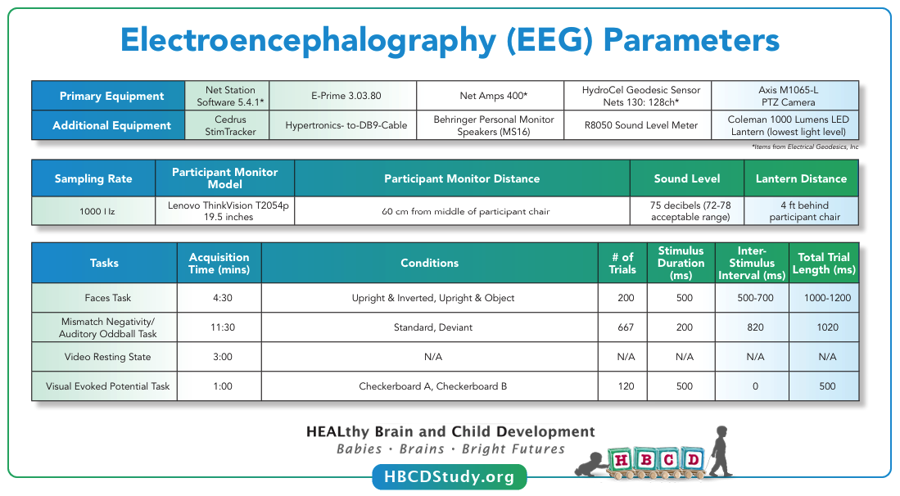

# Electroencephalography (EEG)
EEG tasks are acquired during visits V03, V04, and V06. For full details on the HBCD EEG protocol, please refer to [Fox et al. 2024](https://doi.org/10.1016/j.dcn.2024.101447) published in the Developmental Cognitive Neuroscience special issue on HBCD. EEG data includes:     
• **Tabulated data** (see table names listed [here](../index.md#eeg)) and     
• **File-based data**, including **[raw EEG data in BIDS format](../../datacuration/rawbids.md#eeg)** and processed **[HBCD-MADE pipeline derivatives](../../datacuration/derivatives.md/#hbcd-made-made)**

*Source: [HBCD Study Protocols - EEG](https://hbcdstudy.org/wp-content/uploads/2023/06/EEG-Parameters.pdf)*

## Quality Control    
After EEG acquisition, quality control checks are performed using [EEG2BIDS Wizard](https://github.com/aces/eeg2bids), a custom MATLAB application installed at all HBCD sites. These checks are immediately provided to the user to ensure the data's integrity and usability. The process includes:

- Verifying event markers in the EEG data to confirm all required events are accurately recorded.
- Ensuring the setup for stimulus presentation and EEG data acquisition adheres to the study protocol.
- Inspecting electrode impedances to ensure they are within acceptable limits.
- Detecting multiple task runs and incomplete recordings.
- Confirming the use of correct E-Prime task versions.

Both study sites and the EEG Core team use an EEG Quality Control dashboard developed by LORIS to access and monitor incoming EEG data and QC metrics, such as retained epochs and line noise levels. Outputs from the HBCD-Maryland Analysis of Developmental EEG ([HBCD-MADE](https://hbcd-made.readthedocs.io/en/latest/)) pipeline, which handles preprocessing and data cleaning, are also integrated into the dashboard. These outputs include key metrics like outlier statistics for specific task epochs ([Debnath et al., 2020](https://doi.org/10.1111/psyp.13580)). Regular site-specific check-ins and troubleshooting are conducted to ensure consistent protocol adherence and data quality across sites. For a detailed description of QC procedures in the HBCD Study EEG protocol, refer to [Fox et al., 2024](https://doi.org/10.1016/j.dcn.2024.101447).

During quality control, a frequently observed issue across all tasks was the irregular application of EEG sensors. Additionally, partial task completion due to infant fussing and missing stimulus flags were commonly noted for the faces and auditory mismatch negativity tasks.

### EEG Net Placement ("Capping Quality") Ratings

  <i class="fa-regular fa-lightbulb"></i>
    EEG data with a capping quality rating of "Not usable" are not included in the current release. Capping ratings can be found in the tabulated QC file for each task (<code>eeg_qc_task-&lt;TASK&gt;</code>).

EEG capping quality ratings are used to determine inclusion in the data release pool and subsequent processing. Photos are taken for each acquisition from the front, back, top, left, and right angles of the participant's head and uploaded via the BIDS Wizard application to a secure computing environment. They are then reviewed by the EEG Core at the University of Maryland to rate the quality of EEG net placement, or "capping quality," for each acquisition. 

“Average”, "Poor," and "Not usable" ratings correspond to net placement shifted 1-2 cm, 2-3 cm, and >3 cm from proper placement, respectively. To be rated as "Excellent," acquisitions must meet the following criteria:

1.	Net placement is symmetrical with midline electrodes centered on the scalp
2.	Ears are within the ear holes and not covered by sensors 
3.	Reference electrode is placed on the vertex of the scalp
4.	Electrode E17 is placed on the nasion

Please refer to the [HBCD EEG Acquisition Protocol](https://zenodo.org/records/14795030) for additional information about capping requirements.

## Resources
- [HBCD EEG Utilities](https://hbcd-eeg-utilities.readthedocs.io/)
- [HBCD E-Prime Task Manual](https://docs.google.com/document/d/1PghQQpLbxjQavtVlHyIz7JVJxlyKcC4Do8z8j7srdaI/edit?usp=sharing)
- [HBCD EEG Acquisition Protocol](https://zenodo.org/records/14795030)

## References

    
Debnath, R., Buzzell, G. A., Morales, S., Bowers, M. E., Leach, S. C., & Fox, N. A. (2020). The Maryland analysis of developmental EEG (MADE) pipeline. Psychophysiology, 57(6), e13580. <a href="https://doi.org/10.1111/psyp.13580" target="_blank">https://doi.org/10.1111/psyp.13580</a>
  
    
Fox, N. A., Pérez-Edgar, K., Morales, S., Brito, N. H., Campbell, A. M., Cavanagh, J. F., Gabard-Durnam, L. J., Hudac, C. M., Key, A. P., Larson-Prior, L. J., Pedapati, E. V., Norton, E. S., Reetzke, R., Roberts, T. P., Rutter, T. M., Scott, L. S., Shuffrey, L. C., Antúnez, M., Boylan, M. R., … Yoder, L. (2024). The development and structure of the Healthy Brain and Child Development (HBCD) study EEG Protocol. <i>Developmental Cognitive Neuroscience</i>, 69, 101447. <a href="https://doi.org/10.1016/j.dcn.2024.101447" target="_blank">https://doi.org/10.1016/j.dcn.2024.101447</a>
 

 

