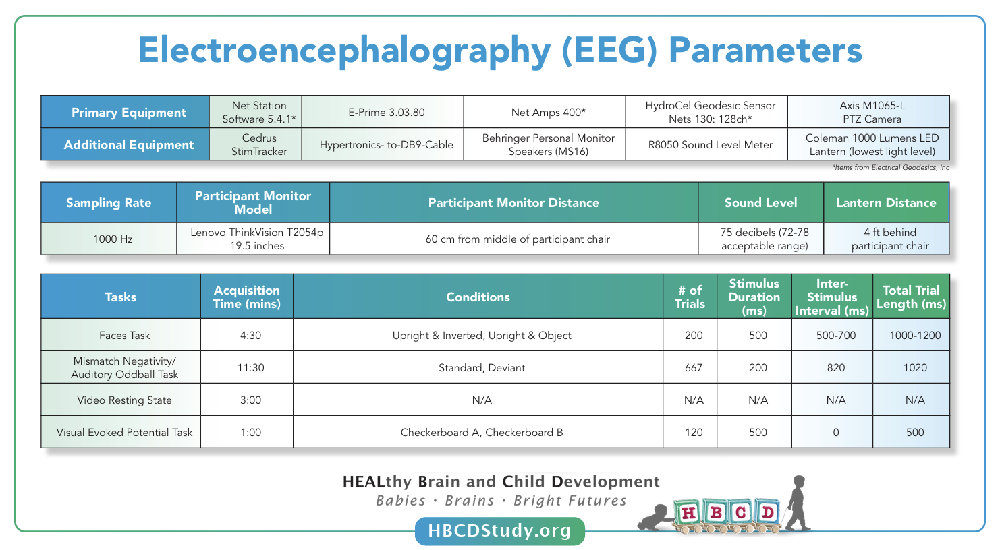

# EEG Protocols

The HBCD study includes four EEG tasks collected during visits V03, V04, and V06. EEG protocols are described in detail in [Fox et al. 2024](https://doi.org/10.1016/j.dcn.2024.101447) and fully documented the [HBCD EEG Acquisition Protocol](https://zenodo.org/records/14795030) and the [HBCD E-Prime Task Manual](https://docs.google.com/document/d/1PghQQpLbxjQavtVlHyIz7JVJxlyKcC4Do8z8j7srdaI/). 

**Click the links below to view high-level summaries for each task:**

- [**MMN** - Auditory Mismatch Negativity](tasks/mmn.md)
- [**FACE** - Faces](tasks/faces.md)
- [**VEP** - Visual Evoked Potential](tasks/vep.md)
- [**RS** - Video Resting State](tasks/rs.md)

---

{{ alert_warning(instruments.eeg) }}
{{ data_warning(instruments.eeg) }}
{{ issues_banner() }}

