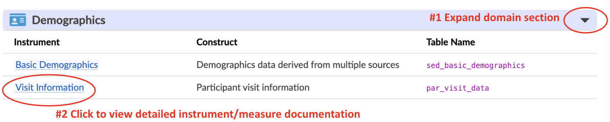

# Study Instruments
In this section we provide a brief overview of each study instrument provided in the data release, including, where applicable, details of implementation and data collection, scoring procedures, quality control procedures, data and responsible use warnings, and references. Full study protocols are available on the [HBCD Study site](https://hbcdstudy.org/study-protocols/). See [Pending Updates](../changelog/pending.md) for details on what to expect in future releases.

## Age Of Child at Each Visit
<table class="table-no-vertical-lines" style="width: 100%; border-collapse: collapse; table-layout: fixed;">
<tbody>
<tr>
<td><b>Visit 1 (V01)</b></td>
<td><b>Visit 2 (V02)</b></td>
<td><b>Visit 3 (V03)</b></td>
<td><b>Visit 4 (V04)</b></td>
<td><b>Visit 5 (V05)</b></td>
<td><b>Visit 6 (V06)</b></td>
<td><b>Visit 7 (V07)</b></td>
</tr>
<tr>
<td>Prenatal</td>
<td>0-1 month</td>
<td>3-9 months</td>
<td>9-15 months</td>
<td>10-17 months</td>
<td>15-30 months</td>
<td>16-32 months</td>
</tr>
</tbody>
</table>

## Spanish Translations
All surveys used in the HBCD Study were translated into Spanish by <a href="https://burgtranslations.com/our-services/">BURG Translations</a> and reviewed by the Spanish Language Committee (SLC) to ensure clarity and accessibility for a broad Spanish-speaking population. Instruments from third-party publishers (e.g., Bayley, CDI, BTB, Vineland) were excluded from this process, and the third party's translation was used.

## Data Collected at Visits

## Data Types Included in Release

**HBCD Study data includes both tabulated and file-based data - see <a href="../datacuration/overview" target="_blank">Data Structure Overview</a> for details.** In summary:

- <a href="../datacuration/phenotypes" target="_blank">Tabulated data</a> contain data across all participants organized according to a standardized tabulated format for HBCD (*includes Behavior, Biospecimens, Demographics, data derived from file-based MR/EEG data, etc.*).
- <a href="../datacuration/file-based-data/" target="_blank">File-based data</a> are in varied, modality-specific formats. This includes <a href="../datacuration/file-based-data/#raw-bids" target="_blank">raw BIDS data</a> and <a href="../datacuration/file-based-data/#derivatives" target="_blank">processed derivatives</a> organized under subject/session-level folders (*MRI/MRS, EEG, and Wearable Sensors*) as well as <a href="../datacuration/file-based-data/#concatenated-data" target="_blank">concatenated data</a> aggregated across participants for certain modalities (*including Genomics*).

Expand the sections below to see a list of measures associated with each domain included in the latest release data.

## Instruments by Domain

Expand the sections below to see a list of measures associated with each domain included in the latest release data.

--------------

<button id="toggle-all-btn" style="
  padding: 2px 14px;
  font-size: 1em;
  border: 1px solid #ccc;
  border-radius: 4px;
  cursor: pointer;
">
  Expand All Sections ↕️
</button>

### Demographics

  <i class="fas fa-id-card"></i>
  
  Demographics
  <a class="anchor-link" href="#demo" title="Copy link">
  <i class="fa-solid fa-link"></i>
  </a>
  
  ▸

<table class="compact-table-no-vertical-lines" style="width: 100%; border-collapse: collapse; table-layout: fixed;">
  <thead>
    <tr>
      <th style="width: 30%;">Instrument</th>
      <th style="width: 30%;">Construct</th>
      <th style="width: 30%;">Table Name</th>
    </tr>
  </thead>
  <tbody>
  <tr>
    <td><a href="demo/basicdemo" target="_blank">Basic Demographics</a></td>
    <td>Demographics data derived from multiple sources</td>
    <td><code>sed_basic_demographics</code></td>
  </tr>
    <tr>
    <td><a href="demo/visitinfo" target="_blank">Visit Level Data</a></td>
    <td>Participant visit information</td>
    <td><code>par_visit_data</code></td>
  </tr>
</tbody>
</table>

### Behavior, Biology, & Environment

  <i class="fa fa-people-arrows"></i>
  
  Behavior & Caregiver-Child Interaction
  <a class="anchor-link" href="#mh" title="Copy link">
  <i class="fa-solid fa-link"></i>
  </a>
  
  ▸

<table class="compact-table-no-vertical-lines" style="width: 100%; border-collapse: collapse; table-layout: fixed;">
<thead>
  <tr>
    <th>Instrument</th>
    <th>Version</th>
    <th>Construct</th>
    <th>Table Name</th>
  </tr>
</thead>
  <tbody>
  <tr>
    <td><a href="bcgi/chaos" target="_blank">CHAOS</a></td>
    <td></td>
    <td>Family Organization</td>
    <td><code>mh_cg_chaos</code></td>
  </tr>
  <tr>
    <td rowspan="2" style="word-wrap: break-word; white-space: normal;">
      <a href="bcgi/ecpromis" target="_blank">ecPROMIS Child-Caregiver Relationship</a></td>
    <td>&lt;1 year</td>
    <td>Child-Caregiver Interaction</td>
    <td><code>mh_cg_pms__cc__inf</code></td>
  </tr>
  <tr>
    <td>1-5 years</td>
    <td>Child-Caregiver Interaction</td>
    <td><code>mh_cg_pms__cc__1to5</code></td>
  </tr>
  <tr>
    <td style="word-wrap: break-word; white-space: normal;">
      <a href="bcgi/ecpromis-pr" target="_blank">ecPROMIS Peer Relationships</a></td>
    <td></td>
    <td>Peer Relationships</td>
    <td><code>mh_cg_pms__peer</code></td>
  </tr>
  <tr>
    <td style="word-wrap: break-word; white-space: normal;">
      <a href="bcgi/ecpromis-selfreg" target="_blank">ecPROMIS Self-Regulation</a></td>
    <td></td>
    <td>Self-Regulation and Flexibility</td>
    <td><code>mh_cg_pms__selfreg</code></td>
  </tr>
  <tr>
    <td><a href="bcgi/fad" target="_blank">FAD (GF6+)</a></td>
    <td></td>
    <td style="word-wrap: break-word; white-space: normal;">Global Functioning of Family Unit</td>
    <td><code>mh_cg_fad</code></td>
  </tr>
  <tr>
    <td rowspan="2"><a href="bcgi/ibqr" target="_blank">IBQ-R (VSF)+BI / ECBQ (VSF)+BI</a></td>
    <td>Infant (<i>I</i>)</td>
    <td rowspan="2">
      Surgency/Extraversion, 
      Negative Affectivity, 
      Effortful Control, 
      Behavioral Inhibition (<i>BI</i>)</td>
    <td><code>mh_cg_ibqr</code></td>
  </tr>
  <tr>
    <td>Early Childhood (<i>EC</i>)</td>
    <td><code>mh_cg_ecbq</code></td>
  </tr>
  <tr>
    <td rowspan="2"><a href="bcgi/maps-tl" target="_blank">MAPS-TL</a></td>
    <td>Infancy (< 1 year)</td>
    <td rowspan="2">Irritability</td>
    <td><code>mh_cg_mapdb__inf</code></td>
  </tr>
  <tr>
    <td>Toddlerhood & Preschool</td>
    <td><code>mh_cg_mapstl__tod</code></td>
  </tr>
  </tbody>
  </table>

  <i class="fa fa-vial"></i>
  
  Biospecimen & Omics
  <a class="anchor-link" href="#biospec" title="Copy link">
  <i class="fa-solid fa-link"></i>
  </a>
  
  ▸

<i style="color: teal;" class="fas fa-layer-group"></i>&nbsp;= Concatenated Data - <a href="../datacuration/file-based-data/#concatenated-data" target="_blank"><i>see details</i></a>

<table class="compact-table-no-vertical-lines" style="width: 100%; border-collapse: collapse; table-layout: fixed;">
<thead>
<th>Instrument</th>
<th>Version</th>
<th>Construct</th>
<th>Table Name / <i style="color: teal;" class="fas fa-layer-group"></i>&nbsp; Concatenated Data Folder</th>
</thead>
<tbody>
<tr>
    <td><i style="color: teal;" class="fas fa-layer-group"></i>&nbsp; <a href="biospec/illumina-gda-gwas" target="_blank">Illumina GDA GWAS</a></td>
    <td>Maternal & Child</td>
    <td>GWAS, EWAS, Transcriptome</td>
    <td><i>genetics/</i></td>
</tr>
<tr>
    <td><a href="biospec/nails" target="_blank">Maternal Nails</a></td>
    <td>Maternal</td>
    <td>Drug, Environmental Exposure</td>
    <td><code>bio_bm_biosample_nails_&lt;results|type&gt;</code></td>
</tr>
<tr>
    <td><a href="biospec/urine" target="_blank">Maternal Urine</a></td>
    <td>Maternal</td>
    <td>Drug Panel, Toxins</td>
    <td><code>bio_bm_biosample_urine_results</code></td>
</tr>
</tbody>
</table>

  <i class="fa-solid fa-puzzle-piece"></i>
  
  Neurocognition & Language
  <a class="anchor-link" href="#ncl" title="Copy link">
  <i class="fa-solid fa-link"></i>
  </a>
  
  ▸

<table class="compact-table-no-vertical-lines" style="width: 100%; border-collapse: collapse; table-layout: fixed;">
<thead>
<tr>
  <th>Instrument</th>
  <th>Version</th>
  <th>Construct</th>
  <th>Table Name</th>
</tr>
</thead>
<tbody>
<tr>
  <td><a href="neurocog/bayley-4" target="_blank">Bayley-4 Scales</a></td>
  <td></td>
  <td style="word-wrap: break-word; white-space: normal;">Child Development (Cognitive, Language, and Motor)</td>
  <td><code>ncl_ch_bayley</code></td>
</tr>
<tr>
  <td rowspan="2"><a href="neurocog/macarthur-bates" target="_blank">MacArthur-Bates CDI-I</a></td>
  <td>English Version</td>
  <td>Language Development (Words & Gestures)</td>
  <td><code>ncl_ch_cdiwgen</code></td>
</tr>
<tr>
  <td>Spanish Version</td>
  <td>Language Development (Words & Gestures)</td>
  <td><code>ncl_ch_cdiwges</code></td>
</tr>
<tr>
  <td><a href="neurocog/mlds" target="_blank">MLDS</a></td>
  <td></td>
  <td>Multilingual Exposure</td>
  <td><code>ncl_ch_mlds</code></td>
</tr>
<tr>
  <td rowspan="2"><a href="neurocog/spm2" target="_blank">Sensory Processing Measure-2 (SPM-2)</a></td>
  <td>Infant</td>
  <td>Sensory Processing/Integration</td>
  <td><code>ncl_cg_spm2__inf</code></td>
</tr>
<tr>
  <td>Toddler</td>
  <td>Sensory Processing/Integration</td>
  <td><code>ncl_cg_spm2__tod</code></td>
</tr>
<tr>
  <td><a href="neurocog/vineland" target="_blank">Vineland Adaptive Behavior</a></td>
  <td></td>
  <td>Adaptive Behavior</td>
  <td><code>ncl_cg_vabs</code></td>
</tr>
</tbody>
</table>

  <i class="fa fa-heart-pulse"></i>
  
  Physical Health
  <a class="anchor-link" href="#ph" title="Copy link">
  <i class="fa-solid fa-link"></i>
  </a>
  
  ▸

<table class="compact-table-no-vertical-lines" style="width: 100%; border-collapse: collapse; table-layout: fixed;">
<thead>
<tr>
  <th style="width: 25%;">Instrument</th>
  <th>Version</th>
  <th style="width: 25%;">Construct</th>
  <th style="width: 25%;">Table Name</th>
</tr>
</thead>
<tbody>
<tr>
  <td><a href="physhealth/bisq-sf" target="_blank">Brief Infant Sleep Questionnaire</a></td>
  <td></td>
  <td>Sleep</td>
  <td><code>ph_cg_bisq</code></td>
</tr>
<tr>
  <td><a href="physhealth/bf" target="_blank">Breast Feeding History</a></td>
  <td></td>
  <td>Nutrition</td>
  <td><code>ph_cg_phx__bfh</code></td>
</tr>
<tr>
  <td><a href="physhealth/ecpromis-pags" target="_blank">ecPROMIS Physical Activity/Greenspace</a></td>
  <td>Early Childhood</td>
  <td>Physical Activity</td>
  <td><code>ph_cg_pms__pags</code></td>
</tr>
<tr>
  <td><a href="physhealth/ecpromis-sleep" target="_blank">ecPROMIS Sleep</a></td>
  <td>Early Childhood</td>
  <td>Sleep</td>
  <td><code>ph_cg_pms__sleep</code></td>
</tr>
<tr>
  <td><a href="physhealth/growth" target="_blank">Height/Weight/Head Circumference</a></td>
  <td></td>
  <td>Growth</td>
  <td><code>ph_ch_anthro</code></td>
</tr> 
<tr>
  <td><a href="physhealth/medical-history" target="_blank">Medical History</a></td>
  <td></td>
  <td>Medical History</td>
  <td><code>ph_cg_ecls__medhist</code></td>
</tr>
<tr>
  <td><a href="physhealth/nutrition" target="_blank">Nutrition Questionnaire</a></td>
  <td>Infant</td>
  <td>Nutrition</td>
  <td><code>ph_cg_inq</code></td>
</tr>
<tr>
  <td><a href="physhealth/screenq" target="_blank">ScreenQ</a></td>
  <td></td>
  <td>Media Use</td>
  <td><code>ph_cg_screenq</code></td>
</tr>
<tr>
  <td><a href="physhealth/vision" target="_blank">Vision Screener</a></td>
  <td></td>
  <td>Vision</td>
  <td><code>ph_ch_vs</code></td>
</tr>
</tbody>
</table>

  <i class="fa-solid fa-baby"></i>
  
  Pregnancy & Exposure, Including Substance Use
  <a class="anchor-link" href="#pex" title="Copy link">
  <i class="fa-solid fa-link"></i>
  </a>
  
  ▸

<i style="color: #ff5df7ff;" class="fa-solid fa-baby"></i>&nbsp;= Pregnancy & Infant Health&nbsp;&nbsp;&nbsp;
<i style="color: #ff5df7ff;" class="fas fa-brain"></i>&nbsp;= Mental Health&nbsp;&nbsp;&nbsp;
<i style="color: #ff5df7ff;" class="fa-solid fa-prescription-bottle"></i>&nbsp;= Substance Use

<table class="compact-table-no-vertical-lines" style="width: 100%; border-collapse: collapse; table-layout: fixed;">
<thead>
<tr>
  <th>Instrument</th>
  <th>Version</th>
  <th>Construct</th>
  <th>Table Name</th>
</tr>
</thead>
<tbody>
<!-- Pregnancy & Infant Health -->
<tr class="section-health">
  <td><i style="color: #ff5df7ff;" class="fa-solid fa-baby"></i> <a href="pregexp/pex/" target="_blank">Health V1-Health History</a></td>
  <td></td>
  <td>Pre-pregnancy and pregnancy health</td>
  <td><code>pex_bm_health_preg__healthhx</code></td>
</tr>
<tr class="section-health">
  <td><i style="color: #ff5df7ff;" class="fa-solid fa-baby"></i> <a href="pregexp/pex/" target="_blank">Health V1-Exp & Vaccines</a></td>
  <td></td>
  <td>Vaccines in pregnancy</td>
  <td><code>pex_bm_health_preg__exp__vacc</code></td>
</tr>
<tr class="section-health">
  <td><i style="color: #ff5df7ff;" class="fa-solid fa-baby"></i> <a href="pregexp/pex/" target="_blank">Health V1-Chronic Conditions</a></td>
  <td></td>
  <td>Chronic conditions/STIs in pregnancy</td>
  <td><code>pex_bm_health_preg__chroncond</code></td>
</tr>
<tr class="section-health">
  <td><i style="color: #ff5df7ff;" class="fa-solid fa-baby"></i> <a href="pregexp/pex/" target="_blank">Health V1-Illness</a></td>
  <td></td>
  <td>Illness in pregnancy</td>
  <td><code>pex_bm_health_preg__illness</code></td>
</tr>
<tr class="section-health">
  <td><i style="color: #ff5df7ff;" class="fa-solid fa-baby"></i> <a href="pregexp/pex/" target="_blank">Health V1-ER Admissions</a></td>
  <td></td>
  <td>ER visit or hospitalization in pregnancy</td>
  <td><code>pex_bm_health_preg__erhosp</code></td>
</tr>
<tr class="section-health">
  <td><i style="color: #ff5df7ff;" class="fa-solid fa-baby"></i> <a href="pregexp/pex/" target="_blank">Health V1-Medications</a></td>
  <td></td>
  <td>Medications in pregnancy</td>
  <td><code>pex_bm_health_preg__meds</code></td>
</tr>
<tr class="section-health">
  <td><i style="color: #ff5df7ff;" class="fa-solid fa-baby"></i> <a href="pregexp/pex/" target="_blank">Health V2-Pregnancy</a></td>
  <td></td>
  <td>Health updates up to delivery</td>
  <td><code>pex_bm_healthv2_preg</code></td>
</tr>
<tr class="section-health">
  <td><i style="color: #ff5df7ff;" class="fa-solid fa-baby"></i> <a href="pregexp/pex/" target="_blank">Health V2-Infancy</a></td>
  <td></td>
  <td>Delivery and birth outcomes</td>
  <td><code>pex_bm_healthv2_inf</code></td>
</tr>
<!-- Mental Health -->
<tr class="section-mh">
  <td><i style="color: #ff5df7ff;" class="fas fa-brain"></i> <a href="pregexp/mh/fam-mh" target="_blank">FAM MH</a></td>
  <td></td>
  <td>Personal and Family Mental Health</td>
  <td><code>pex_bm_psych</code></td>
</tr>
<tr class="section-mh">
  <td><i style="color: #ff5df7ff;" class="fas fa-brain"></i> <a href="pregexp/mh/apa12" target="_blank">APA 1/2</a></td>
  <td></td>
  <td>Mental Health</td>
  <td><code>pex_bm_apa</code></td>
</tr>
<tr class="section-mh">
  <td><i style="color: #ff5df7ff;" class="fas fa-brain"></i> <a href="pregexp/mh/ptsd" target="_blank">DSM5 Acute Stress or PTSD</a></td>
  <td></td>
  <td>PTSD/Acute Stress Symptom Severity</td>
  <td><code>pex_bm_str__ptsd</code></td>
</tr>
<tr class="section-mh">
  <td><i style="color: #ff5df7ff;" class="fas fa-brain"></i> <a href="pregexp/mh/epds" target="_blank">EPDS</a></td>
  <td></td>
  <td>Postnatal Depression</td>
  <td><code>pex_bm_epds</code></td>
</tr>
<!-- Substance Use -->
<tr class="section-su">
  <td><i style="color: #ff5df7ff;" class="fa-solid fa-prescription-bottle"></i> <a href="pregexp/su/assist" target="_blank">ASSIST V1/2/3/4</a></td>
  <td>V1-V4</td>
  <td>Substance Use Pre-, During, and Post-Pregnancy</td>
  <td><code>pex_bm_assistv&lt;1|2|3|4&gt;</code></td>
</tr>
<tr class="section-su">
  <td><i style="color: #ff5df7ff;" class="fa-solid fa-prescription-bottle"></i> <a href="pregexp/su/su-patterns" target="_blank">Substance Use Patterns</a></td>
  <td></td>
  <td>Substance Use in Pregnancy</td>
  <td><code>pex_bm_subst</code></td>
</tr>
<tr class="section-su">
  <td><i style="color: #ff5df7ff;" class="fa-solid fa-prescription-bottle"></i> <a href="pregexp/su/tlfb" target="_blank">TLFB</a></td>
  <td></td>
  <td>SU Before and During Pregnancy</td>
  <td><code>pex_ch_tlfb</code></td>
</tr>
</tbody>
</table>

  <i class="fas fa-city"></i>
  
  Social & Environmental Determinants
  <a class="anchor-link" href="#sed" title="Copy link">
  <i class="fa-solid fa-link"></i>
  </a>
  
  ▸

<i style="color: teal;" class="fas fa-layer-group"></i>&nbsp;= Concatenated Data - <a href="../datacuration/file-based-data/#concatenated-data" target="_blank"><i>see details</i></a>

<table class="compact-table-no-vertical-lines" style="width: 100%; border-collapse: collapse; table-layout: fixed;">
<thead>
<tr>
  <th>Instrument</th>
  <th>Version</th>
  <th>Construct</th>
  <th>Table / <i style="color: teal;" class="fas fa-layer-group"></i>&nbsp; Concatenated Folder</th>
</tr>
</thead>
<tbody>
<tr>
  <td><i style="color: teal;" class="fas fa-layer-group"></i>&nbsp; <a href="SED/geocoded-linkage" target="_blank">Geocoded Linkage</a></td>
  <td></td>
  <td style="word-wrap: break-word; white-space: normal;">Neighborhood Measures</td>
  <td><i>geocoded_linkage/</i></td>
</tr>  
  <tr>
  <td rowspan="2"><a href="SED/aces" target="_blank">Adverse Childhood Experiences</a></td>
  <td>ACEs</td>
  <td>ACEs (Caregiver)</td>
  <td><code>sed_cg_ace</code></td>
</tr>  
<tr>
  <td>Pediatric</td>
  <td>ACEs (Child)</td>
  <td><code>sed_cg_pedaces</code></td>
</tr>  
<tr>
  <td><a href="SED/bfy" target="_blank">Baby's First Years (BFY)</a></td>
  <td></td>
  <td>Benefits/Services/Economic Stress</td>
  <td><code>sed_bm_bfy</code></td>
</tr>
<tr>
  <td><a href="SED/cab" target="_blank">Composite Abuse Scale (CABr-SF)</a></td>
  <td></td>
  <td>Intimate Partner Violence</td>
  <td><code>sed_cg_cabr_sf</code></td>
</tr>
<tr>
  <td><a href="SED/current-employment" target="_blank">Current Employment</a></td>
  <td></td>
  <td>Current Employment</td>
  <td><code>sed_cg_employ</code></td>
</tr>  
<tr>
  <td><a href="SED/demo-cg" target="_blank">Demographics</a></td>
  <td>Adult</td>
  <td>Demographics (Adult V01, V04, V06)</td>
  <td><code>sed_bm_demo</code></td>
</tr> 
<tr>
  <td><a href="SED/demo-ch" target="_blank">Child Demographics</a></td>
  <td>Child</td>
  <td>Demographics (Child V04, V06)</td>
  <td><code>sed_bm_demo_child</code></td>
</tr> 
<tr>
  <td><a href="SED/ehits" target="_blank">eHITS</a></td>
  <td></td>
  <td>Intimate Partner Violence</td>
  <td><code>sed_bm_ehits</code></td>
</tr>  
<tr>
  <td><a href="SED/foodinsecurity" target="_blank">Food Insecurity</a></td>
  <td></td>
  <td>Food insecurity</td>
  <td><code>sed_cg_foodins</code></td>
</tr>
<tr>
  <td><a href="SED/home21" target="_blank">HOME-21</a></td>
  <td>Infant-Toddler</td>
  <td>Child’s Home Environment</td>
  <td><code>sed_cg_home_it</code></td>
</tr>
<tr>
  <td style="word-wrap: break-word; white-space: normal;"><a href="SED/household-chemical-exposures" target="_blank">Household Chemical Exposures</a></td>
  <td></td>
  <td>Household Chemical Exposures</td>
  <td><code>sed_cg_hce</code></td>
</tr>   
<tr>
  <td><a href="SED/lead-exposures" target="_blank">Lead Exposures</a></td>
  <td></td>
  <td>Lead Exposures</td>
  <td><code>sed_cg_leadexp</code></td>
</tr> 
<tr>
  <td><a href="SED/safety" target="_blank">Neighborhood Safety</a></td>
  <td></td>
  <td>Neighborhood Safety</td>
  <td><code>sed_bm_nbhsaf</code></td>
</tr> 
<tr>
  <td rowspan="2"><a href="SED/paces" target="_blank">PACES</a></td>
  <td>Current</td>
  <td>Protective Factors</td>
  <td><code>sed_bm_paces</code></td>
</tr>
  <tr>
  <td>&lt;18</td>
  <td>Protective Factors</td>
  <td><code>sed_cg_paces</code></td>
</tr>
<tr>
  <td><a href="SED/promis" target="_blank">PROMIS</a></td>
  <td></td>
  <td>Perceived Stress/Social Support</td>
  <td><code>sed_bm_strsup</code></td>
</tr>      
<tr>
  <td><a href="SED/second-hand-smoke-exposure" target="_blank">Second Hand Smoke</a></td>
  <td></td>
  <td>Second Hand Smoke Exposure</td>
  <td><code>sed_cg_shs</code></td>
</tr>    
<tr>
  <td><a href="SED/transitions-in-care" target="_blank">Transitions in Care Screener</a></td>
  <td></td>
  <td style="word-wrap: break-word; white-space: normal;">Recruitment/Retention</td>
  <td><code>sed_cg_tic_screener</code></td>
</tr>
<tr>
  <td><a href="SED/discr" target="_blank">Unfair Treatment</a></td>
  <td></td>
  <td>Experiences of Unfair Treatment</td>
  <td><code>sed_bm_phx__discr</code></td>
</tr>  
<tr>
  <td><a href="SED/vi" target="_blank">Vancouver Index (VIA)</a></td>
  <td></td>
  <td>Acculturation</td>
  <td><code>sed_cg_via</code></td>
</tr>      
</tbody>
</table>

### Brain Activity & Biosensors

  <i class="fa-solid fa-file-waveform"></i>
  
  EEG
  <a class="anchor-link" href="#eeg" title="Copy link">
  <i class="fa-solid fa-link"></i>
  </a>
  
  ▸

<i style="color: teal;" class="fa-solid fa-up-right-from-square"></i> <b>Quick Links</b>

<ul>
<li><a href="eeg/" target="_blank">Overview & EEG Protocols</a></li>
<li><a href="eeg/qc" target="_blank">EEG Quality Control Procedures</a></li>
<li><a href="eeg/tasks" target="_blank">HBCD EEG Tasks</a> (<i>Auditory Mismatch Negativity, Faces, Video Resting State, & Visual Evoked Potential</i>)</li>
</ul>

<i style="color: teal;" class="fas fa-folder-open"></i> <b>File-Based EEG Data</b>

<ul>
<li>Raw BIDS stored under subject- and session-specific <a href="eeg/#rawbids" target="_blank"><code>eeg/</code></a> folders</li>
<li>Processed derivatives output by the <a href="eeg/#made" target="_blank">HBCD-MADE</a> pipeline</li>
</ul>

<i style="color: teal;" class="fa-solid fa-table"></i> <b>Tabulated EEG Data</b>

<b>MMN</b>=Auditory Mismatch Negativity; <b>FACE</b>=Faces; <b>RS</b>=Video Resting State; <b>VEP</b>=Visual Evoked Potential

<table class="compact-table-no-vertical-lines">
<thead>
<tr>
<th>Domain</th>
<th>Table</th>
<th>Table Name</th>
</tr>
</thead>
<tbody>
<tr>
  <td rowspan="4">Tabular EEG</td>
  <td><a href="eeg/" target="_blank">EEG Acquisition Checklist</a></td>
  <td><code>eeg_ch_chkl</code></td>
</tr>
<tr>
  <td><a href="eeg/" target="_blank">EEG Acquisition Checklist - Reattempt 1/2</a></td>
  <td><code>eeg_ch_chkl_&lt;1|2&gt;</code></td>
</tr>
<tr>
  <td><a href="eeg/qc" target="_blank">Quality Control Metrics</a></td>
  <td><code>eeg_qc_task-&lt;MMN|FACE|RS|VEP&gt;</code></td>
</tr>
<tr>
  <td>Tabulated HBCD-MADE pipeline derivatives<b>1</b></td>
  <td><code>eeg_made_task-&lt;MMN|FACE|RS|VEP&gt;_acq-eeg_preprocessingReport</code> 
  <code>eeg_made_task-&lt;MMN|FACE|VEP&gt;_ERPSummaryStats</code></td>
</tr>
</tbody>
<tfoot><tr><td colspan="3">
 <b>1</b> See <a href="../datacuration/overview/#warning" target="_blank"><i>Which file-based data are also available as HBCD tabulated data? </i></a>
</td></tr></tfoot>
</table>

  <i class="fa fa-brain"></i>
  
    Imaging
    <a class="anchor-link" href="#mri" title="Copy link">
      <i class="fa-solid fa-link"></i>
    </a>
  
  ▸

<i style="color: teal;" class="fas fa-folder-open"></i> <b>File-Based Data</b>

<table class="compact-table-no-vertical-lines">
<tfoot><tr><td colspan="4">
 <b>1</b> See <a href="../datacuration/overview/#warning" target="_blank"><i>Which file-based data are also available as HBCD tabulated data?</i></a>
</td></tr></tfoot>
<thead>
<tr>
    <th>Modality</th>
    <th>Raw BIDS</th>
    <th>Pipeline Derivatives</th>
    <th>HBCD Tabulated Format Available<b>1</b></th>
</tr>
</thead>
<tbody>
<tr>
  <td rowspan="2">Structural MRI (<a href="mri/smri" target="_blank">sMRI</a>)</td>
  <td rowspan="2"><code>anat/</code></td>
  <td><a href="../../instruments/mri/smri/#bibsnet" target="_blank">BIBSNet</a></td>
  <td style="text-align:center;"><i class="fa-solid fa-check" style="color:green;"></i></td>
</tr>
<tr>
  <td><a href="../../instruments/mri/smri/#mriqc" target="_blank">MRIQC</a></td>
  <td style="text-align:center;"><i class="fa-solid fa-check" style="color:green;"></i></td>
</tr>
<tr>
  <td>Functional MRI (<a href="mri/fmri" target="_blank">fMRI</a>)</td>
  <td><code>func/</code>, <code>fmap/</code></td>
  <td><a href="../../instruments/mri/fmri/#mriqc" target="_blank">MRIQC</a></td>
  <td style="text-align:center;"><i class="fa-solid fa-check" style="color:green;"></i></td>
</tr>
<tr>
    <td rowspan="2">Structural+Functional MRI</td>
    <td rowspan="2"></td>
  <td><a href="../../instruments/mri/fmri/#nibabies" target="_blank">Infant fMRIPrep</a> & <a href="../../instruments/mri/fmri/#fs-mcribs" target="_blank">FreeSurfer & M-CRIB-S</a></td>
  <td style="text-align:center;"><i class="fa-solid fa-x" style="color:red;"></i></td>
</tr>
<tr>
  <td><a href="../../instruments/mri/fmri/#xcpd" target="_blank">XCP-D</a></td>
  <td style="text-align:center;"><i class="fa-solid fa-check" style="color:green;"></i></td>
</tr>
<tr>
    <td>Quantitative MRI (<a href="mri/qmri" target="_blank">qMRI</a>)</td>
    <td><code>anat/</code></td>
    <td><a href="../../instruments/mri/qmri/#derivatives" target="_blank">SyMRI</a> & <a href="../../instruments/mri/qmri/#derivatives" target="_blank">qMRI PostProc</a></td>
    <td style="text-align:center;"><i class="fa-solid fa-x" style="color:red;"></i></td>
</tr>
<tr>
    <td rowspan="2">Diffusion MRI (<a href="mri/dmri" target="_blank">dMRI</a>)</td>
    <td rowspan="2"><code>dwi/</code></td>
    <td><a href="../../instruments/mri/dmri/#qsiprep" target="_blank">QSIPrep</a></td>
<td style="text-align:center;"><i class="fa-solid fa-check" style="color:green;"></i></td>
</tr>
<tr>
<td><a href="mri/dmri/#qsirecon" target="_blank">QSIRecon</a> (<a href="../../instruments/mri/dmri/#qsirecon-DSIStudio" target="_blank">DSI Studio</a>/
  <a href="../../instruments/mri/dmri/#qsirecon-DIPYDKI" target="_blank">DIPY DKI</a>/
  <a href="../../instruments/mri/dmri/#qsirecon-TORTOISE" target="_blank">TORTOISE</a>)</td>
  <td style="text-align:center;"><i class="fa-solid fa-x" style="color:red;"></i></td>
</tr>
<tr>
  <td>MR Spectroscopy (<a href="mri/mrs" target="_blank">MRS</a>)</td>
  <td><code>mrs/</code></td>
  <td><a href="../../instruments/mri/mrs/#derivatives" target="_blank">OSPREY-BIDS</a></td>
  <td style="text-align:center;"><i class="fa-solid fa-check" style="color:green;"></i></td>
</tr>
</tbody>
</table>

<i style="color: teal;" class="fa-solid fa-table"></i> &nbsp; <b>Tabulated Data</b>

<i style="color: teal;" class="fa-solid fa-diagram-project"></i>&nbsp;= Pipeline derivatives available in HBCD tabulated format (<a href="../datacuration/overview/#warning" target="_blank"><i>see details</i></a>)

<table class="compact-table-no-vertical-lines">
<thead>
<tr>
<th>Domain</th>
<th>Table</th>
<th>Table Name</th>
</tr>
</thead>
<tbody>
<tr>
<td rowspan="7"><b>Tabular Imaging</b></td>
  <td><a href="mri/qc/#brainswipes" target="_blank">BrainSwipes (Manual QC)</a></td>
  <td>
  <code>img_brainswipes_xcpd_hash-0f306a2f+0ef9c88a_&lt;T2w|bold&gt;</code> 
  <code>img_brainswipes_xcpd_hash-2afa9081+0ef9c88a_&lt;T1w|bold&gt;</code>
  </td>
</tr>
<tr>
<td><a href="mri/prescan-questionnaire" target="_blank">Pre-Scan Questionnaire</a></td>
<td><code>mri_ra_prep</code></td>
</tr>
<tr>
    <td><i style="color: teal;" class="fa-solid fa-diagram-project"></i>&nbsp; MRIQC pipeline outputs</td>
    <td><code>img_mriqc_&lt;T1w|T2w|bold&gt;</code></td>
</tr>
<tr>
  <td><i style="color: teal;" class="fa-solid fa-diagram-project"></i>&nbsp; BIBSNet pipeline outputs</td>
  <td><code>img_bibsnet_space-&lt;T1w|T2w&gt;_desc-aseg_volumes</code></td>
</tr>
<tr>
  <td><i style="color: teal;" class="fa-solid fa-diagram-project"></i>&nbsp; XCP-D pipeline outputs</td>
  <td><code>img_xcpd_hash-&lt;HASH&gt;_space-fsLR_seg-&lt;PARC&gt;_stat-mean_desc-curv_morph</code> 
    <code>img_xcpd_hash-&lt;HASH&gt;_space-fsLR_seg-&lt;PARC&gt;_stat-mean_desc-sulc_morph</code> 
    <code>img_xcpd_hash-&lt;HASH&gt;_space-fsLR_seg-&lt;PARC&gt;_stat-mean_desc-thickness_morph</code> 
    <code>img_xcpd_hash-&lt;HASH&gt;_space-fsLR_seg-&lt;PARC&gt;_stat-alff_bold</code> 
    <code>img_xcpd_hash-&lt;HASH&gt;_space-fsLR_seg-&lt;PARC&gt;_stat-coverage_bold</code> 
    <code>img_xcpd_hash-&lt;HASH&gt;_space-fsLR_seg-&lt;PARC&gt;_stat-reho_bold</code>
  </td>
</tr>
<tr>
  <td><i style="color: teal;" class="fa-solid fa-diagram-project"></i>&nbsp; QSIPrep pipeline outputs</td>
  <td><code>img_qsiprep_space-ACPC_desc-image_qc</code></td>
</tr>
<tr>
  <td><i style="color: teal;" class="fa-solid fa-diagram-project"></i>&nbsp; OSPREY-BIDS pipeline outputs</td>
  <td>
    <code>img_osprey_&lt;Q&gt;_AlphaCorrWaterScaledGroupNormed_Voxel_1_Basis_1</code> 
    <code>img_osprey_&lt;Q&gt;_AlphaCorrWaterScaled_Voxel_1_Basis_1</code> 
    <code>img_osprey_&lt;Q&gt;_CSFWaterScaled_Voxel_1_Basis_1</code> 
    <code>img_osprey_&lt;Q&gt;_TissCorrWaterScaled_Voxel_1_Basis_1</code> 
    <code>img_osprey_&lt;Q&gt;_rawWaterScaled_Voxel_1_Basis_1</code> 
    <code>img_osprey_&lt;Q&gt;_amplMets_Voxel_1_Basis_1</code> 
    <code>img_osprey_&lt;Q&gt;_tCr_Voxel_1_Basis_1</code> 
    <code>img_osprey_HERCULES_qm_processed_spectra</code> 
    <code>img_osprey_unedited_qm_processed_spectra</code>
    </td>
</tr>
<tr>
  <td colspan="3">
    <strong>Label Values Legend</strong> 
    <b style="color: #0077cc;">&lt;HASH&gt;</b>: 0f306a2f+0ef9c88a, 2afa9081+0ef9c88a 
    <b style="color: #0077cc;">&lt;PARC&gt;</b> (parcellations): 4S-{1-10}56Parcels, Glasser, Gordon, MIDB, MyersLabonte, HCP, Tian (HCP & Tian functional only) 
    <b style="color: #0077cc;">&lt;Q&gt;</b> (quantification method): HERCULES_diff1, HERCULES_diff2, HERCULES_sum, unedited_A
  </td>
</tr>
</tbody>
</table>

  <i class="fa fa-microchip"></i>
  
  Novel Technologies & Wearable Sensors
  <a class="anchor-link" href="#sensors" title="Copy link">
  <i class="fa-solid fa-link"></i>
  </a>
  
  ▸

<i style="color: teal;" class="fa-solid fa-up-right-from-square"></i> <b>Quick Links</b>

<ul>
<li><a href="sensors/wearsensors/" target="_blank">Infant Leg Motion - Accelerometry</a></li>
</ul>

<i style="color: teal;" class="fas fa-folder-open"></i> <b>File-Based Data</b>

<ul>
<li>Raw BIDS stored under subject- and session-specific <a href="sensors/wearsensors/#rawbids" target="_blank"><code>motion/</code></a> folders</li>
<li>Processed derivatives output by the <a href="sensors/wearsensors/#derivatives" target="_blank">HBCD-Motion</a> pipeline</li>
</ul>

<i style="color: teal;" class="fa-solid fa-table"></i> &nbsp; <b>Tabulated Data</b>

<table class="compact-table-no-vertical-lines" style="width: 100%; border-collapse: collapse; table-layout: fixed;">
<thead>
<tr>
<th>Instrument</th>
<th>Construct</th>
<th>Table Name</th>
</tr>
</thead>
<tbody>
<tr>
<td><a href="sensors/questionnaire" target="_blank">Infant Sensor Questionnaire 1/2/3</a></td>
<td>Motor Development, Regulation (Sleep/Wake) <i>(Day 1/2/3)</i></td>
<td><code>nt_ch_sens__qtn_&lt;1|2|3&gt;</code></td>
</tr>
<tr>
<td><a href="sensors/wearsensors" target="_blank">Biosensor Receipt</a></td>
<td>Administrative</td>
<td><code>nt_ch_sens_rcpt</code></td>
</tr>
<tr>
<td><a href="sensors/wearsensors" target="_blank">Biosensor Setup</a></td>
<td>Administrative</td>
<td><code>nt_ch_sens_setup</code></td>
</tr>
</tbody>
</table>

