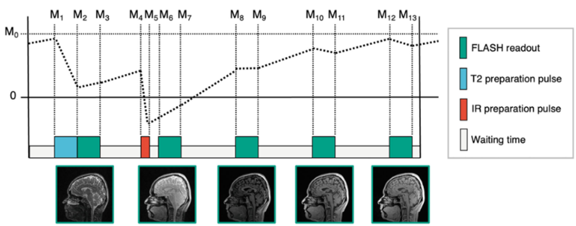

# Quantitative MRI (qMRI)

  <i class="fa-regular fa-lightbulb"></i>
    Please see <a href="../#mri-protocols-sequence-installation">MRI Protocols</a> and <a href="../qc">MR Quality Control Procedures</a> for additional details.

    <i class="fas fa-exclamation-triangle"></i>
  
  Data Warning</i>
  <a class="anchor-link" href="#warning" title="Copy link">
  <i class="fa-solid fa-link"></i>
  </a>
  
  ▸

Note that different sites may apply varying criteria for identifying motion-degraded QALAS and B1⁺ mapping scans. For 3D-QALAS, the SyMRI toolbox does <strong>not</strong> incorporate externally acquired B1⁺ field maps when estimating quantitative T1, T2, and proton density (PD) values.

Additionally, estimated quantitative T1 values show variability across MRI vendors and participant age. Current estimates do not align well with values reported in the literature, likely due to assumptions made in the modeling procedures. Work is ongoing to address these issues. As a result, quantitative T1 values (and by extension, PD values) will not be included in the initial data release.
 

## MRI Acquisitions
### QALAS
The QALAS sequence generates five brain volumes using turbo-flash readouts with varying T2 and T1 weightings. These volumes are used to estimate T1, T2, and proton density (PD) maps. The process begins with a T2-preparation pulse that introduces T2 weighting in the first readout/echo train. After this, an inversion pulse is applied, imparting T1 weighting to the subsequent four echo trains. A schematic of the pulse sequence diagram is shown below with representative images from each of the five acquired volumes ([Figure 1](#figure-1-qalas-pulse-sequence-diagram-courtesy-of-fujita-et-al-2024)). This combination of magnetization preparations allows for the estimation of quantitative T1, T2, and PD maps from the five acquired volumes. The sequence takes approximately 5 and 4 minutes to acquire on Siemens and GE/Philips scanners, respectively.

##### Figure 1. QALAS Pulse Sequence Diagram (courtesy of [Fujita et al, 2024](https://onlinelibrary.wiley.com/doi/10.1002/mrm.29939))

### B1+ Fieldmap
The HBCD MRI protocol includes a brief acquisition (<1 minute) to measure the transmit radiofrequency field map, or B1+ fieldmap. B1+ maps are used to calibrate the flip angle measurements required for accurate and reliable estimation of the T1, T2 and proton density (PD) maps from QALAS images. Ideally, the flip angle prescribed on the MRI scanner would be uniform across the entire imaging volume. However, due to variations and inhomogeneities in the B1+ field, the actual flip angle can vary spatially. The B1+ map represents this spatially varying field and is used to correct flip angle measurements. Because the transmit B1+ field is spatially smooth and changes gradually, coarse resolutions are sufficient for these scans, allowing for fast acquisition times. 

Various methods exist for measuring B1+ fields, and MRI vendors provide different implementations on their platforms. For the HBCD protocol, GE and Philips scanners use the Actual Flip Angle Imaging (AFI) method ([Yarnykh 2007](https://doi.org/10.1002/mrm.21120)) while Siemens scanners use the pre-saturation turbo-flash-readout sequence. Acquisition times are approximately 30–45 seconds across all three scanner types (Siemens, GE, and Philips).

## Derived Images
### Relaxation (T1/T2) & Proton Density (PD) Maps 
For the HBCD study, the MRI working group adopted 3D-QALAS (Kvernby et al. 2014), a time-efficient, three-dimensional method that combines interleaved Look-Locker acquisition with a T2 preparation pulse. This approach enables simultaneous estimation of longitudinal (T1) and transverse (T2) relaxation times, and proton density (PD) maps from a single scan and is validated across all major MRI vendors ([Fujita et al. 2019](https://doi.org/10.1016/j.mri.2019.08.031)).

MRI tissue contrast primarily arises from differences in T1 and T2 relaxation times. Traditional neuroimaging techniques rely on qualitative relaxation time-weighted images (e.g., T1w, T2w scans), which are influenced by various factors, including pulse sequence parameters, participant positioning, and hardware effects. While we include these traditional structural scans in the HBCD protocol, these dependencies complicate interpretation, limiting the ability to associate signal changes with biological mechanisms and making quantitative comparisons across participants, longitudinal sessions, and sites challenging.

This limitation is particularly significant in pediatric neuroimaging, where rapid brain development alters free water distribution, iron content, and myelination. As a result, conventional MRI contrast varies as a function of age, making it difficult to study pediatric populations across diverse age ranges. By directly measuring relaxation properties, quantitative imaging provide insights into these neurobiological mechanisms and overcomes many of the limitations of conventional MRI, offering improved characterization of brain tissue microstructure ([Deoni 2010](https://doi.org/10.1097/RMR.0b013e31821e56d8); [Does 2018](https://doi.org/10.1016/j.neuroimage.2017.12.087)).

### Synthetic T1w/T2w Images
The 3D-QALAS technique in conjunction with the Synthetic MRI (SyMRI) toolbox provides synthetically generated T1-weighted (Sy-T1w) and T2-weighted (Sy-T2w) volumes. Synthetic images are generated by substituting quantitative estimates of T1 and T2 relaxation times back into the governing MR signal equation (or the Bloch equations) for each sequence. This provides the flexibility to produce images of various contrasts without needing to acquire these data at a given set of imaging parameters. 

## References

    
Dean III, D. C., Tisdall, M. D., Wisnowski, J. L., Feczko, E., Gagoski, B., Alexander, A. L., ... &amp; HBCD MRI Working Group. (2024). Quantifying brain development in the HEALthy Brain and Child Development (HBCD) Study: The magnetic resonance imaging and spectroscopy protocol. <em>Developmental Cognitive Neuroscience</em>, 70, 101452. <a href="https://doi.org/10.1016/j.dcn.2024.101452">https://doi.org/10.1016/j.dcn.2024.101452</a>

Deoni, S. C. L. (2010). Quantitative relaxometry of the brain. <i>Topics in Magnetic Resonance Imaging: TMRI</i>, 21(2), 101–113. <a href="https://doi.org/10.1097/RMR.0b013e31821e56d8">https://doi.org/10.1097/RMR.0b013e31821e56d8</a>

Deoni, S. C. L., Rutt, B. K., & Peters, T. M. (2006). Synthetic T1-weighted brain image generation with incorporated coil intensity correction using DESPOT1. <i>Magnetic Resonance Imaging</i>, 24(9), 1241–1248. <a href="https://doi.org/10.1016/j.mri.2006.03.015">https://doi.org/10.1016/j.mri.2006.03.015</a>

Does, M. D. (2018). Inferring brain tissue composition and microstructure via MR relaxometry. <i>NeuroImage</i>, 182, 136–148. <a href="https://doi.org/10.1016/j.neuroimage.2017.12.087">https://doi.org/10.1016/j.neuroimage.2017.12.087</a>

Fautz H-P, Vogel M, Gross P, Kerr A, Zhu Y. B1 mapping of coil arrays for parallel transmission. <i>Proceedings of the 16th Annual Meeting of ISMRM</i>, Toronto, Canada. Vol. 1247. 2008.

Fujita, S., Gagoski, B., Hwang, K.-P., Hagiwara, A., Warntjes, M., Fukunaga, I., Uchida, W., Saito, Y., Sekine, T., Tachibana, R., Muroi, T., Akatsu, T., Kasahara, A., Sato, R., Ueyama, T., Andica, C., Kamagata, K., Amemiya, S., Takao, H., … Aoki, S. (2024). Cross-vendor multiparametric mapping of the human brain using 3D-QALAS: A multicenter and multivendor study. <i>Magnetic Resonance in Medicine</i>, 91(5), 1863–1875. <a href="https://doi.org/10.1002/mrm.29939" target="_blank">https://doi.org/10.1002/mrm.29939</a>

Fujita, S., Hagiwara, A., Hori, M., Warntjes, M., Kamagata, K., Fukunaga, I., Andica, C., Maekawa, T., Irie, R., Takemura, M. Y., Kumamaru, K. K., Wada, A., Suzuki, M., Ozaki, Y., Abe, O., &amp; Aoki, S. (2019). Three-dimensional high-resolution simultaneous quantitative mapping of the whole brain with 3D-QALAS: An accuracy and repeatability study. <i>Magnetic Resonance Imaging</i>, 63, 235–243. <a href="https://doi.org/10.1016/j.mri.2019.08.031">https://doi.org/10.1016/j.mri.2019.08.031</a>

Gonçalves, F. G., Serai, S. D., & Zuccoli, G. (2018). Synthetic brain MRI. <i>Topics in Magnetic Resonance Imaging: TMRI</i>, 27(6), 387–393. <a href="https://doi.org/10.1097/rmr.0000000000000189">https://doi.org/10.1097/rmr.0000000000000189</a>

Ji, S., Yang, D., Lee, J., Choi, S. H., Kim, H., & Kang, K. M. (2022). Synthetic MRI: Technologies and applications in neuroradiology. <i>Journal of Magnetic Resonance Imaging</i>, 55(4), 1013–1025. <a href="https://doi.org/10.1002/jmri.27440">https://doi.org/10.1002/jmri.27440</a>

Kvernby, S., Warntjes, M. J. B., Haraldsson, H., Carlhäll, C.-J., Engvall, J., & Ebbers, T. (2014). Simultaneous three-dimensional myocardial T1 and T2 mapping in one breath hold with 3D-QALAS. <i>Journal of Cardiovascular Magnetic Resonance: Official Journal of the Society for Cardiovascular Magnetic Resonance</i>, 16(1), 102. <a href="https://doi.org/10.1186/s12968-014-0102-0" target="_blank">https://doi.org/10.1186/s12968-014-0102-0</a>

Yarnykh, V. L. (2007). Actual flip-angle imaging in the pulsed steady state: a method for rapid three-dimensional mapping of the transmitted radiofrequency field. <i>Magnetic Resonance in Medicine</i>, 57(1), 192–200. <a href="https://doi.org/10.1002/mrm.21120" target="_blank">https://doi.org/10.1002/mrm.21120</a>

 
